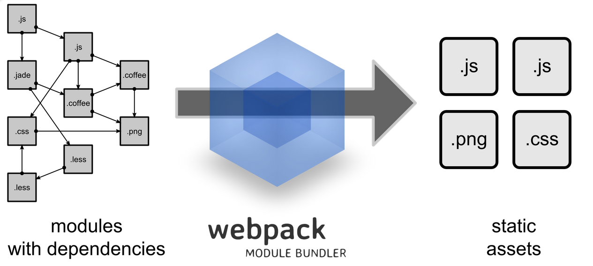

-------------------------------------------------------------------------
<h1>Seção 01 - Criando e configurando o projeto</h1>

<h2>Explicação do Projeto</h2>
Bem-vindo ao curso de React. Meu nome é Alberto Souza, vou estar com vocês apresentando este Framework tão famoso no mundo JavaScript.

Você pode se perguntar: "Por que eu vou usar o React?". A grande vantagem é que ao usá-lo, você facilitará a construção, a manipulação e a atualização do estado da sua tela.

Cadastro de livro

Nosso projeto terá um cadastro com dois cruds, um de "Autores" e outro de "Livros".

Neste primeiro curso, veremos o básico do React para que depois você consiga criar as suas aplicações. Nos próximos cursos veremos as tecnologias adjacentes a esse Framework - que foi criado pelo Facebook e é focado em construir uma View.

Veremos como construir a seguinte tela.

Autores

Após preenchermos os campos e enviarmos os dados, o estado ficará em branco novamente e a tabela abaixo será atualizada.

Autores II

São recursos que podem ser úteis em aplicações de dashboard, por exemplo, em que muitos elementos podem ser atualizados na tela. O React facilitará a nossa vida!

Precisaremos realizar ações semelhantes na página de cadastro de livros.

Livros

A nossa aplicação será composta por uma única tela, após carregarmos o arquivo index.html, a partir dali não daremos mais reload. Isto é o que chamamos de Single Page Applicantion (SPA), que são aplicações com uma única página.

Nossa recomendação é que neste curso, você foque em aprender o básico de React, a navegação, a comunicação entre os componentes e aproveitar bem o que o Framework te oferece. Não se preocupe em conhecer os vários frameworks adjacentes, vamos aprender primeiramente o que é essencial.

A nossa aplicação do Front-End irá consumir informações do Back-end, sendo está outra vantagem do React.

Nós vamos disponibilizar um arquivo .jar, que contem o projeto em Java já pronto e você poderá executá-lo na sua máquina.

Ao rodarmos localmente, não veremos os dados dos outros alunos e teremos a garantia de que a aplicação estará no ar. Você encontrará explicações mais detalhadas aqui!

Com a API pronta poderemos cadastrar os autores e livros.

Espero que você embarque nesta aventura e aprenda como trabalhar com o Framework mais famoso do mercado JavaScript atualmente. Ele é bastante útil!

Assista aos vídeos e resolva os exercícios, caso tenha alguma dúvida, acesse o nosso fórum.

Mais adiante, veremos como fazer as instalações necessários para que a aplicação funcione e para que seja possível rodar o React.

<h2>Configuração ambiente</h2>

Vimos como será nossa aplicação, agora montaremos o ambiente inicial para termos o "Hello World" funcionando.

Eu aconselho que você faça o download do arquivo JAR e rodá-lo sempre localmente. Pode ser que a aplicação saia do ar em algum momento e você não ficará dependente do nosso suporte.

Primeiramente, vamos fazer funcionar o React versão para Front-End.

O React é uma biblioteca do Facebook e podemos baixá-lo no seu Github.

React Download

Qual foi a motivação do Facebook para criar o React? Nós queremos manter ou alterar o estado dos componentes da nossa aplicação. Mas no Facebook, eles precisam trabalhar com diferente notificações no menu visualizado pelo usuário.

Aula1_Menu Facebook

Eles precisam gerenciar muita coisa na tela e o React é ótimo para isto!

Às vezes também o time precisa trabalhar com diferentes pontos de acesso do Back-End, não é necessário criar três aplicações diferentes. Você criará uma que devolve um formato de dados que pode ser lido por diferentes aplicações. Por exemplo, no nosso caso estamos retornando um JSON.

Json

Com este formato, podemos consumi-lo em uma aplicação Android ou iOS, por exemplo, ambas criadas com o React. Quando trabalhamos com JSON - um formato bastante conhecido - você tem a opção de trabalhar com diferentes clientes.

Em seguida, vamos começar a montar a nossa configuração. É possível baixar manualmente o React versão 15.3.1..

Download React2

Você tem a opção de fazer o download do react.js (com a core do framework) e react-dom (que permite manipular os elementos da página).

No entanto, no curso iremos seguir o que o Facebook nos sugeriu fazer: eles criaram um projeto que se chama create-react-app e que nos permite criar uma aplicação com React muito rapidamente. Com ele não precisaremos nos preocupar com as configurações do React. Às vezes você tem o interesse de trabalhar com ECMAScript 6 ou um transpiler.

Neste curso, consideramos que você já tem um conhecimento de JavaScript. Recomendamos que você faça também o curso de JavaScript Avançado I<), você pode aprender mais sobre ECMAScript 6.

Para que o usuário não se precisasse se preocupar com isso, tudo já foi configurado . No fim do curso, temos um vídeo em que veremos como instalar o React e fazer as configurações manualmente.

Então, eu recomendo que você tenha o create-react-app para seguirmos.

Este é um projeto com um código JavaScript de Back-End escrito do lado do servidor, por isso, precisaremos ter instalado também o Node.js, versões posteriores à versão 4 LTS.

Node.js

Se já tivermos instalado, podemos descobrir qual versão estamos usando o comando node -v. Na minha máquina, eu estou usando a versão v4.2.3.

Alura-Azul:alberto alura$ node - v
v4.2.3
Alura-Azul:alberto alura$
Precisaremos do Node para usarmos o create-react-app, não iremos desenvolver efetivamente uma aplicação de back-end com JavaScript.

Você encontrará os passos para a instalação do Node.js clicando aqui.

Com o Node.js instalado, faremos um teste no terminal se ele foi instalado e se o npm - a ferramenta de execução de script prontos - está disponível.

Alura-Azul:alberto alura$ node - v
v4.2.3
Alura-Azul:alberto alura$ npm -v
3.8.3
Com os dois instalados, chegou o momento de adicionarmos o create-react-app.

create-react-app

Vemos que devemos escrever a seguinte linha no terminal:

npm install -g create-react-app
O -g gera uma instalação global na sua máquina. Mas eu segui uma outra opção, criei um pasta chamada alberto e vou usá-la como inicio dos código JavaScript. Para instalação, vou usar o seguinte comando:

Alura-Azul:alberto alura$ npm -v
3.8.3
Alura-Azul:alberto alura$ pwd
/Users/alura/Documents/alberto
Alura-Azul:alberto alura$ npm install create-react-app
Então, o create-react-app será instalado. Após a instalação, será criada a pasta node_modules e dentro dela, a pasta .bin.

Aula 1_Instalação Node

Depois, vamos adicionar a seguinte linha:

Alura-Azul:alberto alura$ ./node_modules/.bin/create-react-app
Estamos fazendo desta forma, porque não fizemos a instalação global. Se o -g foi usado anteriormente, você rodará apenas o create-react-app.

Alura-Azul:alberto alura$ create-react-app
Meu conselho é que você faça com o .bin forma, porque desta forma você terá controle do create-react-app usada e não precisará em ficar atualizando essa informação.

Agora, criaremos o cdc-admin.

Alura-Azul:alberto alura$ ./node_modules/.bin/create-react-app cdc-admin
Será feita a instalação de todas as depedências que o create-react-app fará o download. Já virá o Babel, WebPack. Agora, se precisamos usar o código de ECMAScript 6, que não funcionará no navegador, teremos que ter o suporte dentro do Node.js. Nós precisamos que o código seja transcrita para uma versão que o Node suporte - neste ponto, será útil o Babel, que será o responsável por fazer esta compilação. Porém, ele irá gerar um código final que terá um monte de coisas de Back-End e JavaScript. Ele então, precisará do WebPack. A configuração não é algo trivial. Ela tomará bastante tempo, então, ao eliminar esta parte do processo, o React facilitará bastante.

Após alguns minutos de instalação, será criado um servidor local para você subir sua aplicação JavaScript,

Aula 1_instalação react 2

Você também terá a opção de empacotar a aplicação para disponibilizá-la para o deploy.

Vamos entrar no cdc-admin e depois, rodaremos a aplicação.

Alura-Azul:alberto alura$ cd cdc-admin/
Alura-Azul:cdc-admin alura$ npm start

> cdc-admin@0.1.0 start /Users/alura/Documents/alberto/cdc-admin
> react-scripts start
Após subi-la, o nosso projeto estará criado.

Welcome to React

Importante: O Facebook não criou uma ferramenta para ser customizável. Eles incluíram apenas o que acreditam ser suficiente para o desenvolvimento de uma aplicação. Então é necessário seguir alguma convenções.

Vamos abrir o cdc-admin no Sublime - você poderá utilizar outro editor de texto. Veremos que foi criada uma pasta chamada src, nela encontraremos o arquivo index.html com o código fonte.

Aula 1_index html

Este é um arquivo obrigatório. O servidor local que será configurado entende que o ponto de entrada da aplicação é o index.html. Não é possível modificar esta condição.

O código-fonte que chegará no navegador, terá incluído uma modificação no arquivo, ao inserir uma chamada para o arquivo JS gerada pelo webpack. Podemos ver isso na seguinte linha localizada no fim:

<script type="text/javascript" src="/static/js/bundle.js">
Dentro do arquivo bundle.js encontraremos o CSS, além diversas bibliotecas JS e as classes que serão usadas. Ele também assumirá que foi criado um arquivo chamado index.js, em que encontraremos código de ECMAScript 6.

import React from 'react';
import ReactDOM from 'react-dom';
import App from './App';
import './index.css'
Nós veremos um pouco sobre o assunto, mas você encontrará mais sobre o assunto nos curso de JavaScript Avançado da Alura. Observe que encontraremos a informação de que o arquivo index.css foi importado. O responsável por disponibilizar isso é o Webpack.

Temos também um trecho com código do React:
<br/>

```html

ReactDOM.render(
  <App />
  document.getElementById('root')

);
```
<br/>

Nós veremos isso detalhadamente mais adiante. Outro ponto que iremos ver é o uso do JSX, um JavaScript que tem suporte a XML declarado dentro do código.

Então, esta é a estrutura que trabalharemos. O Hello World já está funcionando, entenderemos mais adiante o que foi feito e depois, iremos deixá-lo com a cara da nossa aplicação.

<h2>Um pouco de JSX e Babel</h2>
Já subimos a nossa aplicação, configurou o ambiente, falamos do Node.js e do npm. Também usamos o create-react-app para criar a nossa aplicação. Mas antes de começarmos a modificar o Hello World, vamos rever o que foi gerado, para não termos a impressão de que tudo foi criado magicamente.

Com o comando npm start vamos subir a aplicação. Ao usarmos o create-react-app, ele trouxe um servidor simples que subiu o nosso HTML rapidamente. Desta forma, tornou-se possível acessá-lo usando uma porta.

Outro ponto é que quando rodamos o npm start, ele executara um comando. Quando criamos um projeto que rodará dentro do Node e usa o npm, automaticamente, será gerado um arquivo chamado package.json que terá as explicações do seu projeto.
<br/>

```html

{
  "name": "cdc-admin",
  "version": "0.1.0",
  "private": true,
  "devDependencies": {
    "react-scripts": "0.3.1"
  },
  "dependencies": {
    "react": "^15.3.1",
    "react-dom": "^15.3.1"
  },
  "scripts": {
    "start": "react-scripts start",
    "built": "react-scripts build",
    "test": "react-scripts test --env=jsdom",
    "eject": "react-scripts eject"
  },
  "eslintConfig": {
    "extends": "./node_modules/react-scripts/config/eslint.js"
  }
}

```

<br/>
Temos o nome do projeto, a versão, as dependências que declaramos do projeto. Iremos analisar uma propriedade do arquivo chamada scripts e dentro, uma que chama start. Quando executarmos npm start no Terminal, ele deve executar o comando react-scripts start.

O create-react-app criou a pasta node_modules e podemos ver que uma grande quantidade de itens foi configurado.

Node_module

Dentro da pasta da pasta react-script, encontraremos a bin, que quando selecionada, veremos react-scripts.js. O arquivo executará os comandos necessários para o create-react-app, podemos ver que ele chamará o node.
<br/>

```html

var result = spawn.sync(
  'node',
  [require.resolve('.../scripts/' + script)].concat(args),
  {stdio: 'inherit'}
);

```

<br/>
Outro ponto que você deve observar está no arquivo index.js.
<br/>

```html

ReactDOM.render(
  <App />
  document.getElementById('root')
);

```

<br/>
A linha <App /> é uma marcação XML, que se fosse simplesmente declarado no código JS não seria válido.

Com o React, nós escrevemos uma linguagem escrita sobre JS. Nós utilizamos a linguagem JSX que nos permite usar marcações XML.

JSX github

Porém, o seguinte trecho do App.jstambém não seria válido dentro de um componente do React.
<br/>

```html

  <div className="App">
    <div className="App-header">
      
      <h2>Welcome to React</h2>
    </div>
    <p className="App-intro">
      To get started, edit <code>src/App.js</code> and save to reload.
    </p>
  </div>

```
<br/>
Precisamos conseguir transformar este código não válido, para outro em JS que seja aceito.

Babel j

O Babel que está é instalado juntamente com o create-react-app é o Babel, um compilador (ou um transpiler) de código fonte JavaScript.

Neste caso, ele pegará um código escrito com ECMAScript 6, que ainda só é exportada pelo Node.js, e irá suportar a sintaxe inválida do JS. Precisaremos usar o Babel, no entanto, na última versão do mesmo, ele vem puro. Isto significa que se você quer que as chamadas do JSX sejam convertidas em de React, precisaremos de um plugin do React chamado JSX transform. No site, vemos o exemplo de uma entrada e saída de um código:

Aula 1_Babel entrada e saida

Seria desanimador ter que escrever este código.

O Babel também nos ajudará a escrever classes, usando herança, graças aos imports da versão mais nova do JS.
<br/>

```html

import React, { Component } from 'react';
import logo from './logo.svg';
import './App.css';

class App extends Component {
  render() {
    return (
      <div className="App">
        <div className="App-header">
          
          <h2>Welcome to React</h2>
        </div>
        <p className="App-intro">
          To get started, edit <code>src/App.js</code> and save to reload.
        </p>
      </div>
    );
  }
}

export default App;

```

<br/>
Nós podemos declarar uma biblioteca e importar os módulos expostos por esta. Todas estas features não funcionariam automaticamente dentro do Node.

Vamos conhecer a utilidade de outro plugin do Babel: ES2015 preset.

Aula 1_ES2015

Com ele, podemos fazer diversas conversões para versões antigas do JS. Este é outro plugin que já vem configurado com o create-react-app. Ele ainda possui um script que ficar verificando se existem falhas no nosso código. Veja o que aconteceria se esquecêssemos de fechar a <div>.

Aula 1_Failed to compile

Observe que ele apontou a falha de compilação no console.

Apenas esses benefícios já fariam valer a pena usar o create-react-app, porém, mais adiante conheceremos outros benefícios. Veremos como o seguintes imports serão suportados:

<br/>
```html

import logo from './logo.svg';
import './App.css';

```

<br/>
Conheceremos bem o que é feito pelo framework e ver que as coisas não acontecem magicamente no nosso código.


<h2>Um pouco sobre webpack</h2>

No vídeo anterior comentamos sobre o JSX, o Babel e outros elementos que vieram incorporado pelo create-react-app e que não seriam tão fáceis de serem configuradas manualmente. Encontramos alguns itens na versão mais nova do JavaScript no nosso código.

<br/>

```html

import React, { Component } from 'react';
import logo from './logo.svg';
import "./App.css";

class App extends Component {
  render() {
    return (
      <div className="App">
        <div className="App-header">
          
          <h2>Welcome to React</h2>
        </div>
        <p className="App-intro">
          To get started, edit <code>src/App.js</code> and save to reload.
        </p>
      </div>
    );
  }
}
export default App;

```

<br/>
Lembre-se que se você não domina ainda JavaScript Avançados, temos uma série de cursos na Alura!

Então, nós temos a sintaxe de import. Está é uma das maiores vantagens do React, ele permite criar boa parte do código usando sintaxe que será suportada, por exemplo, pelo Babel. Mas o diferencial é que instalamos o React como módulo do Node.Js - não foi necessário baixar o JavaScript. Após a importação, o seu código já funcionará "magicamente" no navegador.

Vamos ver o que o create-react-app teve que configurar:


No entanto, o HTML que roda no navegador não é o mesmo que está no arquivo index.html. A seguinte linha no fim do script recebeu uma alteração.

<script type="text/javascript" src="/static/js/bundle.js"></script></body>
Ele adicionou o bundle.js, arquivo JS que foi gerado e possibilita que a sua aplicação funcione no navegador. Iremos nos aprofundar mais no assunto.

O Babel irá transformar boa parte do código em JS que irá rodar no Node.Js. Os imports que vimos no nosso código não irão ser usados no navegador. Na versão mais atual do JavaScrit, é possível importar módulos, funções e classes.

Você pode ver mais visitando a página do Mozilla Develloper Network e ir na seção Export.

Mesmo que o código do index.html seja convertido pelo Node, que não funcionará no navegador. No código teremos que importar logo.svg, que não é suportado em nenhuma versão do JS.
<br/>

```html

import React, { Component } from 'react';
import logo from './logo.svg';
import "./App.css";

```
Observe que importamos CSS em um arquivo JS, tudo isso seria impossível, mas nós conseguiremos que ele funcione.

Um detalhe ainda não citado, como estamos usando o JSX, a definição das classes que queremos no nosso HTML, precisam estar acompanhadas do className:
<br/>


```html

<div className="App">
  <div className="App-header">
    
    <h2>Welcome to React</h2>
  </div>
  <p className="App-intro">
    To get started, edit <code>src/App.js</code> and save to reload.
  </p>
</div>

```
Isto acontece, porque class se tornou palavra reservada do JavaScript. Podemos notar outros pontos que deveriam impedir o funcionamento, como os imports de módulos que estão na parte do navegador, mas deveriam estar na parte de Back-End. O responsável pela "mágica" é o Webpack.


Ele irá converter tudo que escrevemos e não deveria rodar no navegador, como podemos ver no diagrama abaixo:



Ele irá pegar o SVG e o CSS e colocará no bundle.js. Você pode analisar todo o contudo gerado no arquivo, mas é um código gerado pela ferramenta. A sugestão é que você entenda que o código foi gerado pelo Webpack, mas compreender cada uma das linhas não é importante (a menos que você tenha o desejo de desenvolver plugins para o Webpack ou Babel).

Então, precisamos saber que apenas o Babel não faria o código funcionar no navegador. Uma outra opção além do create-react-app é a ferramenta chamada Browserify.


Ele é usado com o mesmo objetivo que o Webpack. É provável que no futuro, ferramentas como estas que apresentamos não sejam mais necessárias e os navegadores conseguiram suportar as versões mais atuais do JavaScript.

Então, aproveite para visitar o site do Mozilla e pesquise sobre como importar e exportar um módulo. No nosso projeto, dentro do arquivo React.js, vemos que está sendo exportado o React:

 module.exports = React;
O Webpack irá englobar tudo isso e colocar no arquivo bundle.js.

Antes de seguir para a próxima aula, dê uma olhada no projeto na aplicação. Nós ainda criaremos outras classes e nos aprofundaremos no React. Conheceremos elementos mais específicos no decorrer do curso. Aproveite e faça os exercícios!

<h2>O que nos leva a criar uma aplicação com o React</h2>
Durante a aula debatemos alguns motivos para uma empresa decidir criar uma aplicação usando uma tecnologia como o React, que favorece a construção de Single Page Applications(aplicações que possuem uma página só). Assinale a alternativa que contém todas opções discutidas.

R: Separação de times, reaproveitamento de API's e telas com muitos pontos de atualização
Quando você decide construir uma aplicação que vai ser inteiramente baseada em Javascript, HTML e CSS a primeira coisa que você ganha é um time super focado nesses itens. Claro que você pode possuir pessoas que dominem backend e frontend, mas não é incomum você ter pessoas com mais habilidade em um lado ou outro.

O segundo ponto é que se a sua aplicação vai ser acessada por diferentes tipos de clientes, como: android, iOS, navegador ou uma aplicação terceira, você ficou obrigado a disponibilizar os dados em um formato diferente de respostas HTML. O formato mais usado hoje em dia é o JSON e nesse caso frameworks Javascript se integram muito bem.

O terceiro ponto é quando você possui telas que, em função de um evento, precisam ter alguns pontos atualizados. Quanto mais complexa é a tela, mais complicado isso fica. O React deixa esse tarefa consideravelmente mais simples. Você vai atualizar uma informação e vai avisar a ele que agora uma atualização é necessária.

Pode ser que seu projeto decida usar o React pelos três motivos, ou talvez até por apenas um. Apenas lembre que é importante você usar a ferramenta por conta de uma necessidade específica.


------------------------------------------------------------------------------
<h1>Seção 02 - Definindo a estrutura do html do cadastro de autor</h1>

<h2>Importando CSS</h2>

Nós já conseguimos importar o projeto, mostramos um pouco de tudo que o create-react-app pode fazer. Ele trouxe parte do Webpack que pegou o nosso código escrito para Node.js e transformou em um código que pudesse rodar no navegador. Usamos também o Babel que fez as transformações de JSX para códigos válidos.

Agora, vamos começar a deixar a aplicação com a cara que desejamos. Usaremos um projeto que tem vários CSS prontos, chamado Pure CSS - mais simples que o Bootstrap.

Pure CSS

O projeto é bastante simples, usaremos um layout semelhante ao do Pure CSS, teremos a navegação no menu da lateral esquerda, enquanto o cadastro estará no conteúdo central da página.

Primeiramente, faremos o download do arquivo .zip do Pure CSS. Você encontrará explicações clicando aqui. O site também oferece o CSS de estilos prontos, nós aproveitaremos o Responsive Side Menu.

Aula 2_Pure Css Responsive Side Menu 

Os arquivos serão salvos na pasta Downloads.

Pasta de Dwnloads

Queremos entrar na pasata pure-release-0.6.0 e depois, selecionar o pure-min.css.

pure min

Vamos voltar para o Terminal. Lembrando que todos os arquivos referentes ao código-fonte, guardaremos no src.

Vamos criar uma nova pasta css.

Alura-Azul: src alura$ pwd
/Users/alura/Documents/alberto/cdc-admin/src
Alura-Azul:src alura$ mkdir mkdir css
Depois, navegaremos dentro dessa pasta.

Alura-Azul: css alura$ pwd
/Users/alura/Documents/alberto/cdc-admin/src/css
Alura-Azul:css alura$ cp ~/Downloads/pure-release-0.6.0/
Em seguida, vamos entrar e copiar o pure-min.css.

Alura-Azul:css alura$ cp ~/Downloas/pure-release-0.6.0/pure-min.css
Após fazermos a cópia, navegaremos para layouts.

Alura-Azul:css alura$ cp ~/Downloads/pure- .
pure-layout-side-menu/     pure-release-0.6.0/
pure-layout-side-menu.zip  pure-release-0.6.0.zip
Alura-Azul:css alura$ cp ~/Downloads/pure-layout-side-menu/css/layouts/side-menu.css .
Alura-Azul:css alura$
Vamos copiá-lo igualmente.

Alura-Azul:css alura$ ls -l
total 56
-rwxr-xr-x@ 1 alura  staff   17286 Sep 5 15:38 pure-min.css
-rwrr-xr-x@ 1 alura  staff    5016 Sep 5 15:38 side-menu.css
Alura-Azul:css alura$
Agora, copiamos os dois arquivos CSS. Até o momento, estamos importando um arquivo App.css, que já existia desde que baixamos o create-react-app.

App css

Mas não queremos usar este arquivo.

Este importe de CSS só será possível, porque o Webpack transforma o CSS em um código JS. Na documentação do JavaScript não existe nenhuma especificação que nos permita importar CSS.

O arquivo que queremos importar é o pure-min.css.
<br/>
```html

import React, { Component } from 'react';
import logo from './logo.svg';
import './css/pure-min.css';
import './css/side-menu.css';

```
Observe que também importaremos o arquivo side-menu.css.

Para verificarmos se tudo corre bem, podemos usar o comando start na pasta padrão. Ele subirá o projeto, e irá inicializá-lo no servidor de desenvolvimento.

Compilado com sucesso

Agora, que já temos o CSS importado, vamos começar a brincar com o React. Nós já citamos que ele é muito utilizado para a construção de páginas e seus componentes. Vimos também que com ele podemos escrever HTML, dentro do JS. Vamos voltar para o nosso arquivo HTML e apagar o extenso comentário que havia nele. Observe que temos uma div de marcação: id="root". Ele irá procurar automaticamente o index.js dentro da pasta src. Depois, ele importará itens do React. Temos dois módulos baixados: react e o react-dom.

Você também teria a opção a opção de baixar o React e criar manualmente a estrutura. Nós pulamos esta parte, mas no fim do curso veremos detalhadamente.

Usando o create-react-app, nós estamos rodando o código basicamente usando o Node.js. Nele, nós instalamos módulos, que carregam classes expostas por estes. Existem dois módulos que vamos usar com maior frequência: o ReactDOM é uma classe que cria os elementos em memória e simula o DOM do seu navegador. Também precisaremos do módulo React, que permite criar novos componentes.

No github do Facebook, vemos que é possível criar novos elementos diretamente. Vamos acessar a documentação que é bastante detalhada.

criar elemento diretamente

Nós vemos como poderíamos criar uma li ou uma ul, mas como usamos o JSX não foi necessário. Mas até aqui, estaríamos utilizado tags normais do HTML.

Mas vamos consultar na documentação o que seria necessário para criar novos componentes.

ReactComponents

Vemos que a classe React tem um método chamado createClass, com ele podemos criar os nossos componentes.

Se acessarmos o arquivo App.js, veremos que estamos criando um Component.
<br/>
```html

class App extends Component{
  render() {
    return (
      <div className="App>"
        <div className="App-header">
          
          <h2>Welcome to React</h2>
        </div>
        <p className="App-intro">
          To get started, edit <code>src/App.js</code> and save to reload.
        </p>
      </div>
    );
  }

```

E além de importarmos o módulo React, faremos o import do Component que está dentro do módulo React do Node.js:

import React, { Component } from 'react';
Se vamos escrever o Component em classes, faremos o extends Component. Se formos usar a sintaxe do JavaScript mais antigo, será preciso invocar o método createClass e depois, passaremos as diversas funções que serão chamadas durante a construção da View. Por enquanto, a mais relevante é a função render().

Vamos ver o render(), no arquivo index.js:

```html

ReactDOM.render(
  <App />,
  document.getElementById('root')
);

```
Nós estamos importando o módulo App.
```html

import React from 'react';
import ReactDOM from 'react-dom';
import App from './App';
import './index.css';

```
Que exportará a si mesmo no fim do arquivo App.js.

export default App;
Como ele exporta por default não é preciso usar as chaves ({}) quando vamos importar no index.js.

Já o Component não é o módulo default do react, precisamos especificar que queremos o Component no App.js.

import React, { Component } from 'react';
Nós importamos o módulo App, o que permite usar JSX que irá transformar a chamada de tag < App/> em React.createElement() passando como parâmetro o módulo. Vemos o que acontecerá por debaixo do pano, na documentação do React.

documentação React.createElement

O módulo App exportará a classe que herda de Component, como vimos no App.js.

class App extends Component {
}
E então, a mágica começa a acontecer. Na DOM virtual será criado o seu componente.

Agora, qual método será chamado na class App? O que será retornado pelo render(). Por isso, precisamos que ela esteja definida na nossa classe.

Porém, nós queremos retornar outro HTML. Vamos no pure-layout-side-menu, depois em index.html e então, selecionaremos o layout padrão do código. A parte selecionada começará a partir da seguinte linha:

<div id="layout">
Copiaremos tudo, até o fechamento da <div>. Atualmente, o arquivo App.js, está assim:
```html

class App extends Component{
  render() {
    return (

    );
  }
}
 export default App;

```
Em seguida, vamos colar o HTML copiado do index, logo após o return. Fizemos a proeza de usar código HTML em um arquivo de formato JavaScript. Se não pudéssemos fazer isto, nunca poderíamos usar o React.

Mas se formos testar no navegador, teremos problemas com a compilação.

falha na compilação

Vemos na mensagem que o token é inválido. Esse comentário de HTML não é aceito. Se quisermos manter o comentário, teremos que fazer um código dinâmico, usando as chaves({}).

  { /*Menu toggle*/}
Criamos um comentário comum de JS. Ele já será aceito pelo navegador, mas faltaram coisas para serem alterados.

Falha na compilação 2

Ele apontou que falta fechar algumas tags. Vamos começar pela linha 52 que tem um . Podemos ter um código XML no código JavaScript, mas para que ele seja válido precisamos fechar as tags.

Depois, veremos um outro tipo de mensagem.

Compiled with warning

Este problema com o warning nós resolveremos mais adiante. É um caso de propriedade duplicada, então por enquanto, não veremos isso. Não é um erro, mas sim um aviso.

Se testarmos a página no navegador, veremos que ela foi carregada...

Previa pagina

Mas sem o CSS. Isto aconteceu porque utilizamos o class para definir a classe dos elementos no arquivo App.js.

<a href="#menu" id="menuLink" class="menu-link">
Já explicamos que o class é uma palavra reservada do ECMAScript. No JSX, precisamos substituir por className. Nós podemos usar o "Find > Replace" do editor ou fazer as alterações manualmente. A parte inicial do código ficará assim:
```html

import React, { Component } from 'react';
import './css/pure-min.css';
import './css/side-menu.css';

class App extends Component {
  render() {
    return (
<div id="layout">
//...

```
Lembre-se de que o JSX suporta marcação HTML, mas o atributo class das tags HTML já é uma palavra reservada.

Observe que não substituímos a class do App, porque se trata da classe em si.

Se rodarmos a página no navegador, já veremos que o CSS foi carregado.

Pagina com css

Até aqui começamos a mexer com o React, herdamos de Components, pedimos para ReactDOM renderizar. Nós adicionaremos o layout padrão do cadastro mais adiante.


<h2>HTML cadastro</h2>

Agora que já conseguimos importar o pure-css, aplicamos o CSS do projeto e já adicionamos o componente do React funcionando, vamos deixar a tela central com o conteúdo do cadastro.

Pagina com css

Nós criamos um único componente, chamado App que está sendo utilizado pelo arquivo index.js. Trata-se de uma classe que herda de Component. Também implementamos o método render().

Em seguida, queremos adicionar o nosso cadastro e não o conteúdo que visualizamos na parte central.

Vamos começar fazendo algumas alterações no header. Depois, retiraremos a classe content, que contem o conteúdo atual da parte central da página.
```html

< div id="main">
    <div className="header">
        <h1>Home</h1>
    </div>
</div>

```
Vamos alterar o número de itens do menu da lateral. Dentro da <ul>, deixaremos um <li> apenas para "Autores" e "Livros".
```html

<ul className="pure-menu-list">
    <li className="pure-menu-item"><a href="#" className="pure-menu-link">Home</a></li>
    <li className="pure-menu-item"><a href="#" className="pure-menu-link">Autor</a></li>
    <li className="pure-menu-item"><a href="#" className="pure-menu-link">Livro</a></li>
</ul>

```
Agora, o nosso menu ficará assim:

Menu com 3 itens

Temos um Websocket rodando que o servidor do create-react-app fornece.

websocket

Tudo o que é alterado no editor, ele já publicará as mudanças.

Para nossa primeira página de cadastro, vamos mudar o texto do .
23:54 08/04/2018
```html
<h1> para "Cadastro de autores"</h1>
< div id="main">
    <div className="header">
        <h1>Cadastro de autores</h1>
    </div>
</div>

```
Temos agora que adicionar o HTML do cadastro. Como suponho que este código não será uma novidade para você, foi disponibilizado nos exercícios (ou aqui o trecho referente ao código.

Iremos copiar o código que começa a partir da linha <div id="main">, depois adicionaremos no arquivo App.js.

Fique atento para não copiar divs a mais no fim.

Se rodarmos no navegador, veremos os campos para o cadastro de autores.

Cadastro de autores 2

Ao clicarmos dentro dos campos e digitarmos os dados, eles serão enviados para a aplicação. Se tivermos problema de autenticação, o usuário precisa ver uma mensagem. E quando o dado for salvo, queremos que apareça na tabela abaixo com a listagem - que deverá ser dinâmica. No código atual, a listagem ainda é estática.

Sem o JSX, teríamos que ser verdadeiros "guerreiros" para conseguir criar tudo o que planejamos fazer. O JSX é extremamente importante para os nosso projetos com o React.

<h2>Qual o principal motivo de usarmos JSX?</h2>
Usamos o create-react-app para facilitar a configuração da nossa aplicação. Ele já traz junto dele o Babel que é um compilador de código Javascript para Javascript, também chamado de transpiler. Por exemplo, podemos usar sintaxe suportada pelo ES6 e o JSX justamente por conta dele, que já veio configurado com os plugins necessários para essa compilação. Falando especificamente do JSX, qual o motivo da sua utilização?

R: O JSX possibilita que utilizemos sintaxe de XML, HTML por exemplo, como se isso fizesse parte do Javascript

Quando usamos o React, trabalhamos com os componentes que utilizam código HTML diretamente do código Javascript. Até poderia ser usado as funções do próprio React para isso, mas, como vimos, acabaríamos com um código complicado de ler. O JSX nos ajuda justamente nisso, permitindo que escrevamos código "html" que na verdade vai ser convertido para Javascript exigido pelo React. Por sinal, essa conversão só é possível porque já está habilitado o React JSX Transform, do Babel. Confira aqui => http://babeljs.io/docs/plugins/transform-react-jsx/

<h2>Como é que nosso código está funcionando no navegador?</h2>

Durante a apresentação do código gerado pelo create-react-app, vimos que foram usadas classes e imports de módulos. Assinale a alternativa que indica o(s) motivo(s) desse código funcionar no seu navegador.

R: O react-create-app traz junto Babel e o webpack. Essas duas ferramentas, combinadas, possibilitam que todo o código ES6 seja transformado para um Javascript válido no navegador.

O Babel é um famoso transpiler que tem a capacidade, utilizando plugins, de pegar o seu código fonte escrito na versão mais nova do Javascript(ES6) e transformá-lo num código da versão antiga do Javascript(ES5). Por exemplo, a versão recomendada de download do Node.js ainda não implementa todas as funcionalidades do ES6.

Só que esse código Javascript gerado ainda é um código válido para o ambiente de servidor, por exemplo se você estiver usando um Node.js. Como o objetivo é que o código rode no navegador, precisamos de alguém para fazer uma segunda transformação, e é justamente aí que entra o Webpack. Ele vai transformar, por exemplo, as linhas de import de módulo JavaScript e CSS em um código válido no navegador. Como foi explicado no vídeo, essa transformação toda é "cuspida" no arquivo bundle.js.

-------------------------------------------------------------------------------------
<h1>Seção 03 - Consumindo a API e dando vida a nossa listagem</h1>

<h2>Manutenção estado componente</h2>

Nos importamos o nosso layout e já conseguimos visualizar a versão do cadastro que será utilizada.

Cadastro de autores 2

Porém, ele ainda está estático. Nós somos obrigados a implementar o método render(), porque ele que é invocado pelo React para retornar o pedaço de HTML na View.

Se olharmos no código, vemos que ele está estático. O menu e os campos do formulários devem ser assim mesmo, mas a tabela não. E nisto que iremos trabalhar agora: trabalhar com os dados da tabela dinamicamente. Quando falamos que o React nos ajuda a criar os nossos componentes, e que estes terão vida ou estado, falamos de certas similaridades com orientação de objeto.

Até agora a classe App definiu comportamento, usando a função render(). Como podemos ver no início do arquivo App.js.
```html

class App extends Component{
  render() {
    return (
      <div id="layout">
          <a href="#menu" id="menuLink" className="menu-link">

              <span></span>
          </a>

          <div i="menu">
              <div className="pure-menu">
                  <a className="pure-menu-heading" href="#">Company</a>
                  <ul className="pure-menu-list">
                      <li className="pure-menu-item"><a href="#" className="pure-menu-link">Home</a></li>
                      <li className="pure-menu-item"><a href="#" className="pure-menu-link">Autor</a></li>
                      <li className="pure-menu-item"><a href="#" className="pure-menu-link">Livro</a></li>
                  </ul>
//...

```
O método render() é invocado e depois retornará o trecho de HTML. Lembre-se que estamos usando o JSX, logo será transformado para invocações React.createElemente retornará a versão do DOM que será colocada na página pelo React. Tudo isso se refere a comportamento. No entanto, em orientação para objetos falamos de comportamento e estado - que ainda não foi adicionado na nosso código.

Em seguida, adicionaremos um estado ao Component. Ao misturarmos comportamento e estado, teremos um objeto de verdade. Vamos começar declarando um constructor(). A sintaxe usada será o ECMAScript 6, caso tenha alguma dúvida, consulte nossos cursos de JavaScript Avançado da Alura e fique mais à vontade com o assunto.
```html

class App extends Component {
  constructor() {
    this.state = {lista : []};
  }
//...
}

```
Observe que utilizamos a variável disponibilizada pelo React, chamada state. Nela, guardaremos o JSON que representa o estado do objeto. Dentro, iremos colocar a lista de autores.

Nós vamos rodar novamente o npm start para subir o servidor de desenvolvimento. E ele indicará que tivemos um falha de compilação. Esta ação evita que o erro só seja descoberto já no navegador.

Erro de compilação

A mensagem nos avisa que não podemos chamar o this antes de usarmos o super(), que a invocação do construtor do Component. Após isto, o this será setado e poderemos utilizá-lo.

```html

class App extends Component {
  constructor() {
    super();
    this.state = {lista : []};
  }
//...

```
Não teremos mais o problema com a compilação, mas não veremos mudança no cadastro. Até aqui, apenas avisamos ao React que guardamos a variável lista associado com o array, no state.

Dado que teremos uma lista, precisamos exibir as informações. Para começar, adicionaremos alguns dados estáticos.

 this.state = {lista : [{nome:'alberto', email:'alberto.souza@caelum.com.br',senha:'123456'}]};
Agora desceremos no código até a tag <tbody>em que temos outra informação estática.

```html

 <div>
    <table className="pure-table">
      <thead>
        <tr>
          <th>Nome</th>
          <th>email</th>
        </tr>
      </thead>
      <tbody>
        <tr>
          <td>Alberto</td>
          <td>alberto.souza@caelum.com.br</td>
        </tr>
      </tbody>
    </table>
</div>

```
Onde tem o código estático com os dados do Alberto, vamos gerar um código dinâmico. Sempre que falarmos em código dinâmico, precisaremos usar as chaves do JSX. Dentro delas, guardaremos o state.

```html

<tbody>
  {
    this.state.lista
  }
</tbody>

```
Do array de objetos literais lista nós devolvemos partes de HTML. Para cada novo cadastro que for feito no formulário, teremos que criar uma nova <tr>. No ECMAScript 6 foi incorporada uma função chamada map, usada geralmente quando temos um vetor (uma lista) e queremos mapeá-lo para outro vetor. No nosso caso, queremos mapear a lista de autores, para uma lista de trechos de HTML. E informaremos que vamos retornar uma <tr>, o que significa que devolveremos React.createElement.

```html

<tbody>
  {
    this.state.lista.map(function(autor){
      return (
        <tr>
        </tr>
       );
      })
  }
</tbody>

```
Para cada linha do autor, vamos exibir o "Nome" e o "Email".
```html

<tbody>
  {
    this.state.lista.map(function(autor){
      return (
        <tr>
          <td>{autor.nome}</td>
          <td>{autor.email}</td>
        </tr>
        );
      })
  }
</tbody>

```
Vamos compilar e ver se tudo está funcionando bem.

Tabela dinamica

Aparentemente, o nosso código funciona. Mas vamos fazer outro teste. A informação estática que foi preenchida com meu email, vou substitur pelo email "heisenberg@gmail.com".

```html

<tbody>
 <tr>
   <td>Alberto</td>
   <td>heisenberg@gmail.com</td>
 </tr>
</tbody>

```
Tabela dinamica 2

Desta forma que mantemos estados dentro dos nossos componentes. Nós apenas começamos, por enquanto, o estado ainda é estático. Mas já montamos um componente com informações dinâmicas.

Mais adiante, iremos alterar o componente com informações estáticas para que este recupere os dados da API e montando-os em tempo de execução.


<h2>Atualização de estado componentes</h2>
Temos a lista e estamos mantendo o estado dentro do componente. Estamos também usando a variável state, porém ela está sendo inicializada com o valor estático. No entanto, queremos que JSON seja retornado por meio da API.

Vou fazer algumas alterações no código, mas peço que você espere e não programe antes de terminar a leitura das explicações. Em algumas situações, serão apresentados alguns erros e você poderá ser induzidos a cometê-los também. A recomendação é que você complete a aula e depois siga para os exercícios ou modifique o projeto.

Vamos apagar o JSON do state.
```html

constructor() {
  super();
  this.state = {lista : []};
}

```
Se a nossa tela for recarregada, não terá mais mais as informações anteriores.

Precisamos que os dados venham de algum lugar para popular a tabela, sem fazer uma nova requisição, considerando que estamos falando de uma single page application. Queremos entrar uma vez na página e não dar reload novamente. Logo, estamos falando de requisições assíncronas, AJAX. Nós usaremos o jQuery para executar os AJAX, porque será a forma mais fácil. Vale ressaltar que poderemos instalar o jQuery como dependência do Node.Js já que estamos usando o create-react-app. Com isso, poderemos importar o módulo como se fosse o ECMAScript 6 e o Webpack transformará isso para versão final do JavaScript que rodará no navegador.

No App.js, vamos importar o jquery.

```html

import React, { Component } from 'react';
import './css/pure-min.css';
import './css/side-menu.css';
import $ from 'jquery';

```
Observe que demos um apelido (antecedido pelo cifrão $) para o módulo jquery. Veja que também já podemos vê-lo no menu da lateral.

modulo jquery

Nós temos um construtor que é chamado quando o componente é instanciado. Teríamos a opção de já enviar o ajax da jQuery a partir do construtor.
```html

constructor() {
  super();
  this.state = {lista : []};
  $.ajax({
      url:"http://localhost:8080/api/autores"
      dataType: 'json',
      success:function(resposta){
        this.state = {lista:resposta};
      })
    }
  );
}

```
Nós poderíamos escrever o código do Ajax, incluindo o tipo de dados que esperávamos que seria retornado, e ele funcionaria perfeitamente. Mas faltaria um detalhe, e mesmo assim, funcionaria. No construtor, devemos inicializar valores, qualquer coisa simples do seu componente, como inicializar o estado, por exemplo.

Nós queremos que estes dados sejam carregados e atualizados na tela.

Porém, existe uma questão de boa prática do React para considerarmos. O React fornece funções que serão chamadas em determinados ciclos de vida do componente. Uma delas é componentDidMount() usada quando o componente acabou de ser montado. Ela será chamada logo após o método render() ser invocado pela primeira vez.

Uma outra função é o componentWillMount(), que será chamada antes da invocação do render().
```html

constructor() {
  super();
  this.state = {lista : []};

componentWillMount()
  $.ajax({
      url:"http://localhost:8080/api/autores",
      dataType: 'json',
      success:function(resposta){
        this.state = {lista:resposta};
      }
    }
  );
}

```
Eu sugiro que você siga as boas práticas do React. Os projetos Reacts do mercado costumam seguir estas práticas. É incomum encontrar projetos que façam Ajax direto do construtor.

Já colocamos o Ajax, agora, se mexermos no estado, precisamos que a tela seja novamente renderizada.

Porém, se testarmos nosso código no navegador, não veremos nada. Se pesquisarmos no Console, ele indicará que ocorreram vários erros.

Aula 3_2_Erros no console

O primeiro erro indicado é o de sintaxe. Isso ocorreu, porque adicionamos um ; a mais na chave abaixo do this.state. Com a correção, nosso código ficará assim:
```html

constructor() {
  super();
  this.state = {lista : []};

componentWillMount(){
  $.ajax({
      url:"http://localhost:8080/api/autores",
      dataType: 'json',
      success:function(resposta){
        this.state = {lista:resposta};
      }
    }
  );
}

```
Aula 3_2_Cadastro funcionando

Mas veja que não aparece a tabela. No console, veremos que ele tentou fazer uma requisição GET para o endereço da API de autores, mas o nosso sistema está fora do ar.

Vamos até o diretório onde colocamos o arquivo jar-cdc-react.jar.

JAR

Nós disponibilizamos o endereço do Heroku, no entanto, ele destrói os servidores quando eles ficam muito tempo sem serem acessados.

Aula 3_2_herokuapp

Está funcionando, mas eu não recomendo que você dependa do HeroKuapp. Nós poderíamos aproveitar o endereço que vemos na tela, no código. Mas o arquivo JAR tem um servidor embutido. A aplicação já está rodando, e com o Java instalado (veja aqui, como fazer a instalação), você usará o seguinte comando no Terminal:

 Alura-Azul:alberto alura$ java -jar jar-cdc-react.jar
Minha sugestão é que você faça o download do JAR, clicando aquie rode localmente a aplicação.

Quando ele começar a rodar a sua aplicação, vão aparecer alguns logs no seu Console. Depois, no navegador mudaremos o endereço para localhost:8080/api/autores. Com isso, não dependeremos do servidor estar no ar, porque a aplicação está na sua máquina.

Se tentarmos subir a aplicação no navegador, ele funcionará corretamente, mas também não atualizou a tabela. Este é um ponto importante.

Nós definimos o estado com a variável state, que foi associado ao JSON. Depois, redefinimos a variável state, associando um JSON, mas com a variável lista juntamente com o resposta. A resposta está sendo retornada. Podemos ver isso, adicionando o console.log no código abaixo:

```html

constructor() {
  super();
  this.state = {lista : []};

componentWillMount(){
  $.ajax({
      url:"http://localhost:8080/api/autores"
      dataType: 'json',
      success:function(resposta){
        console.log(resposta);
        this.state = {lista:resposta};
      }
    }
  );
}
//...

```
Console log

Vemos três objetos sendo visualizados.

A questão é que sempre que mudemos de estado, o React deve invocar a função render(). Mais adiante, teremos uma explicação profunda sobre o assunto.

Nós queremos modificar o estado e que ele renderize novamente o componente. Poder delegar esta função para o React é uma das grandes vantagens.

Mas seria esperar demais se nós mudássemos uma variável e o React ficasse observando o que está acontecendo. Ele precisaria ter um looping infinito. Iria consumir demais a sua CPU. O melhor é invocarmos uma função do React chamada setState e passe para ele o state com a propriedade que nós queremos que seja atualizada.
```html

constructor() {
  super();
  this.state = {lista : []};

componentWillMount(){
  $.ajax({
      url:"http://localhost:8080/api/autores"
      dataType: 'json',
      success:function(resposta){
        console.log(resposta);
        this.setState({lista:resposta});
      }
    }
  );
}
//...

```
Desta forma, nós informamos para o React que estamos alterando o estado e que ele precisa renderizar novamente o componente.

No entanto, se testarmos novamente, vamos nos decepcionar. A aplicação ainda não vai funcionar.

Aula 3_2_TypeError

Por isso, você recebeu a recomendação de não criar o código durante a explicação.

A mensagem de erro diz:

Uncaught TypeError: this.setState is not a function
Vamos ver novamente no Console.

Erro com this

O this que aparece no Console tem a ver com a jQuery e não com o React. No entanto, o jQuery não tem a função setState.

Vamos ter que fazer uma alteração muito importante para que o nosso código funcione. Toda função do JavaScript tem um método chamado bind(). Nós iremos usá-lo e informar que o this da função é do React.
```html

componentWillMount(){
  $.ajax({
      url:"http://localhost:8080/api/autores"
      dataType: 'json',
      success:function(resposta){
        console.log(this);
        this.setState({lista:resposta});
      }.bind(this)
  }
);

```
Agora, conseguiremos ver a tabela.

tabela dinamica funcionando

Após usarmos setState(), ele chamou o render().

A seguir, veremos um detalhe interessante. Se o WillMount será chamado antes do render(). Vamos ver no Console.
```html

componentWillMount(){
  $.ajax({
      url:"http://localhost:8080/api/autores"
      dataType: 'json',
      success:function(resposta){
        this.setState({lista:resposta});
        }.bind(this)
  }
);

render() {
  console.log("render");
  return (
    <div id="layout">
//...

```
Aula 3_2_willMount Console 2 

A mensagem de Warning veremos mais adiante. Agora, veja que ele chamou primeiro o WillMount e depois chamou o render duas vezes, porque nossa chamada é assíncrona. Por isso, ele delegará a execução do Request e em seguida, continuará com a execução. Depois, virá a chamada do render. Para entendermos melhor, vamos ver a mensagem chegou a resposta no Console. E vemos o render novamente.
```html

componentWillMount(){
  console.log("willMount");
  $.ajax({
      url:"http://localhost:8080/api/autores",
      dataType: 'json',
      success:function(resposta){
        console.log("chegou a resposta");
        this.setState({lista:resposta});
        }.bind(this)
  }
);

```
O componente chamará o render() sempre que você chamar o setState(). Isto significa que nós nunca mais precisaremos concatenar as tags <tr> da tabela ou mexer manualmente na estrutura dos elementos. Nós só temos que nos preocupar com o estado e o React se ocupa de fazer a mágica.

Mais adiante, veremos alguns detalhes sobre os ciclos de vida. Nós vimos o componentWillMount(), conheceremos outra função do ciclo de vida que é indicada pela documentação do React para casos em que queremos trabalhar com Ajax. Também veremos por que está aparecendo a mensagem com warning. E veremos uma explicação final sobre o que está sendo retornado.

<h2>Ciclo de vida e DOM virtual</h2>

Nós já criamos a listagem dinâmica. Agora, vamos ver mais alguns detalhes sobre o React.

Anteriormente falamos sobre a função do ciclo de vida do componentWillMount(), que é chamada antes da render() ser invocada. Vamos conhecer mais o que está acontecendo nos bastidores.

Faltou falar sobre um detalhe. O componentWillMount() não executa nenhuma lógica, não faz nenhuma preparação de informações que ficarão armazenadas no estado do componente que já poderá ser aproveitada para primeira invocação do render().

```html

constructor() {
  super();
  this.state = {lista : []};

componentWillMount(){
  console.log("willMount");
  $.ajax({
      url:"http//localhost:8080/api/autores"
      dataType: 'json',
      success:function(resposta){
        console.log("chegou a resposta");
        this.setState = ({lista:resposta});
      }
    }
  );
}
//...

```
Aula 3_3_chegou a resposta

A única coisa que o willMount faz é disparar a requisição assíncrona. O ideal seria que ele fosse utilizado quando fizéssemos uma requisição síncrona. Por exemplo, essa lista poderia ser localizada do local Storage do navegador do seu cliente. Você poderia manter uma lista armazenada local e recuperar os dados. Como a nossa requisição é assíncrona, não faz muito sentido passar por esta função antes de passar pela renderização. Uma função mais apropriada seria a componentDidMount, que só será chamada após a primeira renderização.

```html


constructor() {
  super();
  this.state = {lista : []};

componentDidMount(){
  console.log("didMount");
  $.ajax({
      url:"http//localhost:8080/api/autores"
      dataType: 'json',
      success:function(resposta){
        console.log("chegou a resposta");
        this.setState = ({lista:resposta});
      }
    }
  );
}
//...

```
Desta forma, renderizamos o que é necessário, e acabou. Caso seja necessário será feito uma atualização do estado que será refletido em outra renderização do componente.

Podemos consultar a documentação do React LifeCycle, na parte referente aos métodos, veremos que existem outras funções do ciclo do React.

Aula 3_3_Lifecycle Methods

Por exemplo, se a tela for super completa, será que é vantajoso chamar o render para todos os componentes? Pode ser um processo pesado. Para estes casos, temos uma função chamada shouldComponentUpdate.

shouldComponentUpdate

Você pode verificar a documentação e ver mais a respeito.

Warning

A mensagem nos diz que cada linha da tabela, com os vários elementos dentro de um elemento pai (a tabela) deveria ter um identificador. Na verdade, a pergunta é para que ele precisa que cada elemento tenha um identificador próprio. Para entendermos isso, precisamos compreender como o React trabalha. O React, sempre que chamamos o setState(), ele chamará o render(). Entre ele retornar o que foi retornado pelo render e aplicar essa alteração diretamente na página, existe uma distância. O algoritmo dele de atualização do DOM da sua página. A solução mais simples seria chamar o setStages e atualizar o DOM inteiro da página. Ele nem teria a oportunidade de cometer o erro. Porém, se a tela for complexa, existe uma grande chance de ficar lento.

Vamos voltar para o arquivo App.js e entender qual é a grande sacada do React. Lembrando que nós estamos usando um plugin do Babel que transformará um código JSX para outro que seja válido em JavaScript e para uma chamada do React.

```html

render() {
  console.log("render");
  return (
    React.createElement("div",{id:"layout"},React.createElement("a",{}))
    <div id="layout">
        <a href="#menu" id="menuLink" className="menu-link">
            <span></span>
        </a>
        <div id="menu">
//...

```
Com o React não retornaremos strings diretamente. Nós retornaremos vários elementos do React, que chamamos de React Elements. São eles que compõem o que chamamos de DOM virtual. Você encontrará mais ao respeito, na documentação.

A função render() retornará um conjunto de objetos do React - ou seja, parte do Virtual DOM. Ele pega o que foi retornado e avalia com Virtual DOM que está aplicado neste exato momento. Se tiver distinção, então ele irá alterar o estado do DOM real da sua tela.

Para isto, foi criado um algoritmo para que esse processo fosse realizado o mais rápido possível. Se a render() ora retornar uma <div> ou <table>, será fácil identificar essa diferenciação. A dificuldade estará nos casos em que sempre retornamos uma <tbody> com cinco <tr>s, mas com o conteúdo diferente. Para que ele identifique essa mudança será preciso o que é chamado de reconciliação (você encontrará mais a respeito nesta parte da documentação).

Ele precisará retirar o diff, ver se houve alguma mudança e fazer a alteração se for necessário. Quando temos elementos filhos que se repetem dentro de um pai, a sugestão é que adicionemos uma propriedade chama key no elemento.

```html

<tbody>
{
    this.state.lista.map(function(autor){
      return (
        <tr key={autor.id}>
          <td>{autor.nome}</td>
          <td>{autor.email}</td>
        </tr>
      );
    })
  }
</tbody>

```
Observe que usamos um valor que sabemos que se repete, no caso o id do autor. Se o seu objeto não tem id, concatene informações, use a função de hash e que gere um valor único.

No nosso exemplo, ficou fácil, porque ele precisa apenas identificar se o id modificou dentro dos <tbody>, ele simplesmente aplicará a alteração.

Vamos abordar um último tópico.

No nosso código, onde nós concatenamos elementos do nosso DOM? Quando carregamos a lista, onde demos um append na tabela? Ou onde você jogaria o código de um remove da linha? Nós não fizemos isso.

Nós apenas retornamos vários React Elements, e em um determinado ponto, nós estamos concatenando um código dinâmico que também irá gerar vários elementos do próprio React.

Porém, no nosso caso, o código não mudará. O que será alterado é o estado. Sempre que o setState() for chamado, o React invocará a função render(). Costumamos dizer que não manipulamos os elementos com o React, nós declaramos como queremos que um trecho de HTML se comporte. Então, o React será responsável pela manipulação em função das suas invocações do setState. Esta é uma informação super importante. Nós declaramos um comportamento, e o estado do componente indicará o que o React deverá fazer. Ele invocará o render() novamente, será aplicado um novo estado no seu componente, talvez seja gerado um novo Virtual DOM. Logo, ele irá aplicar as aplicações na página.

Meu objetivo era aprofundar mais nestes detalhes.

Faça os exercícios e depois, continue com os cursos!

<h2>Ciclo de vida do componente do React</h2>
Para que nossa listagem aparecesse na tela tivemos que entender um pouco sobre ciclo de vida do React. Assinale a alternativa que possui as funções do ciclo de vida que foram utilizadas.

R: render e componentWillMount

Entender o ciclo de vida do React é muito importante. São essas funções que te dão a chance de interagir com ele. Na maior parte da sua vida, você vai utilizar o render e o componentDidMount. Justamente porque em um você declara o componente em si e no outro você carrega o que pode ser necessário para ele. Entretanto, quando seu projeto evoluir e ficar maior, talvez surja a necessidade você ter que lidar com outras funções do ciclo de vida, como a shouldComponentUpdate. Ela indica para o React se seu componente deve ser renderizado e por default retorna true. Numa tela super complexa, evitar invocações desnecessárias para o render, pode fazer diferença.

Esses detalhes mais avançados, vão ficar para um segundo curso, ainda temos muito do básico do React para ver nesse primeiro curso!

<h2>Como associamos o estado a um componente?</h2>
Para montarmos nossa listagem, puxamos os dados de um serviço que nos retorna um JSON com a listagem e ensinamos ao React que ele deve usar esses dados. Assinale a alternativa que indica como isso é feito.
R: Guardamos um JSON na variável state, disponibilizada pelo próprio React. Depois só alteramos os valores desse JSON através da função setState.

O uso da variável state vai ser uma constante na sua vida programando com o React. Sempre teremos algum componente que vai precisar manter um estado e que precisará ter esse estado atualizado, como já veremos no próximo capítulo :).

```html

import React, { Component } from 'react';
import './css/pure-min.css';
import './css/side-menu.css';
import $ from 'jquery';

class App extends Component {

  constructor() {
    super();    
    this.state = {lista : []};
  }

  componentDidMount(){
    console.log("didMount");
    $.ajax({
        url:"http://localhost:8080/api/autores",
        dataType: 'json',
        success:function(resposta){    
          console.log("chegou a resposta");          
          this.setState({lista:resposta});
        }.bind(this)
      } 
    );          
  }

  render() {
    console.log("render");        
    return (
      <div id="layout">

          <a href="#menu" id="menuLink" className="menu-link">

              <span></span>
          </a>

          <div id="menu">
              <div className="pure-menu">
                  <a className="pure-menu-heading" href="#">Company</a>

                  <ul className="pure-menu-list">
                      <li className="pure-menu-item"><a href="#" className="pure-menu-link">Home</a></li>
                      <li className="pure-menu-item"><a href="#" className="pure-menu-link">Autor</a></li>
                      <li className="pure-menu-item"><a href="#" className="pure-menu-link">Livro</a></li>


                  </ul>
              </div>
          </div>

              <div id="main">
                  <div className="header">
                    <h1>Cadastro de Autores</h1>
                  </div>
                  <div className="content" id="content">
                    <div className="pure-form pure-form-aligned">
                      <form className="pure-form pure-form-aligned">
                        <div className="pure-control-group">
                          <label htmlFor="nome">Nome</label> 
                          <input id="nome" type="text" name="nome" value=""  />                  
                        </div>
                        <div className="pure-control-group">
                          <label htmlFor="email">Email</label> 
                          <input id="email" type="email" name="email" value=""  />                  
                        </div>
                        <div className="pure-control-group">
                          <label htmlFor="senha">Senha</label> 
                          <input id="senha" type="password" name="senha"  />                                      
                        </div>
                        <div className="pure-control-group">                                  
                          <label></label> 
                          <button type="submit" className="pure-button pure-button-primary">Gravar</button>                                    
                        </div>
                      </form>             

                    </div>  
                    <div>            
                      <table className="pure-table">
                        <thead>
                          <tr>
                            <th>Nome</th>
                            <th>email</th>
                          </tr>
                        </thead>
                        <tbody>
                          {
                            this.state.lista.map(function(autor){
                              return (
                                <tr key={autor.id}>
                                  <td>{autor.nome}</td>
                                  <td>{autor.email}</td>
                                </tr>
                              );
                            })
                          }
                        </tbody>
                      </table> 
                    </div>             
                  </div>
                </div>            


      </div>     
    );
  }
}

export default App;

```

<h1>Seção 04 - Cadastrando novos autores e atualização de componentes</h1>

<h2>Evento</h2>

Nossa tabela está funcionando e recuperando os dados dinamicamente. Chegou o momento de cadastrarmos informações no nosso formulário. Nós queremos adicionar os dados do "Nome", "Email" e "Senha" e queremos gravá-los.

Cadastro de Autores

No momento em que clicamos no botão gravar, estamos recarregando os dados, que serão reenviados via GET. Primeiramente, teremos que modificar isso. Nós não queremos que a página seja recarregada, queremos que tudo seja feito via AJAX. Para isto, precisamos de um evento associado ao Submit do formulário. O React nos fornece eventos específicos que serão mapeados para eventos do nosso DOM real. Então, temos uma propriedade chamada onSubmit que poderá ser adicionada no formulário. Vamos inclui-la na tag form, que está dentro do main do arquivo App.js.

```html

<div id="main">
                  <div className="header">
                    <h1>Cadastro de Autores</h1>
                  </div>
                  <div className="content" id="content">
                    <div className="pure-form pure-form-aligned">
                      <form className="pure-form pure-form-aligned" onSubmit={this.enviaForm} method="post">
                        <div className="pure-control-group">
                                    <label htmlFor="nome">Nome</label>
                                    <input id="nome" type="text" name="nome" value=""/>
                                </div>
                                <div className="pure-control-group">
                                    <label htmlFor="email">Email</label>
                                    <input id="email" type="email" name="email" value=""/>
                                </div>
                                <div className="pure-control-group">
                                    <label htmlFor="senha">Senha</label>
                                    <input id="senha" type="password" name="senha"/>
                                </div>
                                <div className="pure-control-group">
                                    <label></label>
                                    <button type="submit" className="pure-button pure-button-primary">Gravar
                                    </button>
                                </div>
                      </form>

```

Observe que no onSubmit, nós chamamos a função enviaForm, porque queremos enviar os dados via AJAX. Por isso também, o método de envio de formulários será post. Antes do render, criaremos a função enviaForm e o evento que gerou o disparo da função.

```html

enviaForm(evento){
}

render() {
  console.log("render");
  return (
    React.createElement("div",{id:"layout"},React.createElement("a",{}))
    <div id="layout">
        <a href="#menu" id="menuLink" className="menu-link">
            <span></span>
        </a>

```
Trata-se de um evento do React e não do DOM "real". Na documentação, eles são chamados de SyntheticEvents - eventos do React que mapeiam para eventos reais, incluindo o Submit. Vamos incluir um console.log() e ver o que está acontecendo e apagaremos os adicionados anteriormente.
```html

componentDidMount(){
  console.log("didMount");
  $.ajax({
      url:"http//localhost:8080/api/autores",
      dataType: 'json',
      success:function(resposta){
        this.setState = ({lista:resposta});
      }.bind(this)
    }
  );
}     
enviaForm(evento){
  console.log("dados sendo enviados");
}

```
Após nos certificarmos de que tudo está compilando bem, vamos subir a aplicação e analisar o console. Também deixaremos marcada a opção "Preserve log".

Dados sendo enviados

A página ainda é recarregada, mas o evento foi chamado. Mas precisamos que a página não seja mais recarregada. Nós adicionamos um evento, mas que continua sendo propagado, da mesma forma que seria feito no DOM "real". Queremos que ele mapeie a função preventDefault, ela indicará quando não desejamos que um evento continue sendo propagado.
```html

enviaForm(evento){
  evento.preventDefault();
  console.log("dados sendo enviados");
}

```
Vamos clicar novamente em "Gravar" e ver o que acontecerá.

dados sendo enviados 2

Agora a página já não foi recarregada. Resolvemos essa parte. Próximo passo, precisamos dos dados que serão enviados para fazer a nossa requisição.

Novamente, sugerimos que você espere a conclusão da explicação para começara a trabalhar com o código.

Usamos o preventDefault, recebemos o evento do formulário, e queremos enviar os dados. Para isto, vamos enviar um AJAX por meio de uma jQuery. Adicionaremos o JSON. Lembrando que você não precisa memorizar todas as funções ou variáveis usadas, ainda que com a prática você irá aprendê-las. Mas é sempre possível recorrer a uma material de consulta. No entanto, é necessário saber como elas funcionam.

No código, usaremos a propriedade url, além disso queremos que os dados sejam enviados e respondidos no formato JSON. E o contentType irá avisar como os dados serão enviados e o dataType, informa o formato da resposta. O tipo de requisição será post e os dados enviados poderão ser uma string, mas por enquanto não temos nada.
```html

$.ajax({
    url:"http//localhost:8080/api/autores",
    contentType: 'application/json',
    dataType:'json',
    type:'post',
    data:"{}",
    success: function(resposta){
      console.log("enviado com sucesso");
    },
    error: function(resposta){
        console.log("erro");
    }

```
Nós mapeamos a função de sucess que irá lidar com a resposta. Mais adiante, nosso formulário terá que lidar com problemas que poderão ocorrer no envio dos dados, como os de validação, por exemplo. Por isso, já adicionamos uma função que saiba trabalhar com o erro. Pedimos para aparecer no console, uma mensagem avisado se a requisição foi enviada com sucesso ou se ocorreu um erro.

Vamos fazer um novo teste. Após clicarmos no botão "gravar", veremos a mensagem de erro no Console.

Mensagem de Erro

O servidor retornou um status com o número 400, que chama Bad Request. Isto indica que a nossa requisição teve dados inválidos.

json com mensagens de invalidação

O servidor retornou um JSON com todas as mensagens de validação em função das funções vazias que enviamos. Lembrando que nosso API já está pronta, o que precisamos alterar é a parte da aplicação Cliente.

Em vez de concatenamos o JSON manualmente, existe a classe JSON (escrita em caixa alta no JavaScrit) e o método stringify(), que ao passarmos um objeto literal que será transformada em uma string. Iremos adicioná-los no data.
```html

$.ajax({
    url:"http//localhost:8080/api/autores",
    contentType: 'application/json',
    dataType:'json',
    type:'post',
    data: JSON.stringify({nome:'',email:'',senha:''}),
    success: function(resposta){
      console.log("enviado com sucesso");
    },
    error: function(resposta){
        console.log("erro");
    }

```
Agora, precisamos pensar: de onde virá o "nome", o "email" e a "senha".

Vou te deixar pensando no assunto e mais adiante vamos resolver esta questão!

<h2>Manutenção do estado form e mais eventos</h2>
Deixei você pensando como poderia pegar a informação do "nome", "email" e "senha" que queremos enviar no formulário.
```html

enviaForm(evento){
   evento.preventDefault();    
   $.ajax({
     url:'http://localhost:8080/api/autores',
     contentType:'application/json',
     dataType:'json',
     type:'post',
     data: JSON.stringify({nome:'',email:'',senha:''}),
     success: function(resposta){
       console.log("enviado com sucesso");
     }.bind(this),
     error: function(resposta){
       console.log("erro");
     }      
   });
 }

```
Quando montamos a nosso listagem dinâmica, quando falamos ou pensamos em manter uma informação, manter um estado, usamos a variável state. Faremos o mesmo com o formulário, precisaremos manter o "nome", o "email" e a "senha". Se você estivesse no modelo normal de JavaScript acessando informações do formulário, nós faríamos referências. Mas no nosso caso, não manipulamos elementos diretamente, por isso usaremos o state. O responsável por manipular o elemento é o React.
```html

enviaForm(evento){
   evento.preventDefault();    
   $.ajax({
     url:'http://localhost:8080/api/autores',
     contentType:'application/json',
     dataType:'json',
     type:'post',
     data: JSON.stringify({nome:this.state.nome,email:this.state.email,senha:this.state.senha}),
     success: function(resposta){
       console.log("enviado com sucesso");
      }.bind(this),
     error: function(resposta){
       console.log("erro");
     }      
   });
 }

```
Também vamos declarar que existem tais propriedades no state.

```html

 constructor() {
    super();
    this.state = {lista : [],nome:'',email:'',senha:''};
 }

```
Agora, está claro quais são as informações mantidas dentro do nosso componente. No entanto, se testarmos no nosso navegador, veremos que aparecerá uma mensagem de erro no Console.

erro

O que está acontecendo é que o valor do this é nulo. Vamos imprimir no console para compreender o que está acontecendo.
```html

enviaForm(evento){
  evento.preventDefault();
  $.ajax({
     url:'http://localhost:8080/api/autores',
     contentType:'application/json',
     dataType:'json',
     type:'post',
     data: JSON.stringify({nome:this.state.nome,email:this.state.email,senha:this.state.senha}),
     success: function(resposta){
       console.log("enviado com sucesso");
    },
     error: function(resposta){
       console.log("erro");
     }      
   });
 }

```
o this está nulo

Por Default, as funções que você declara dentro da sua classe, não usaram o bound() e não estão associadas com o this do objeto. Infelizmente, isto não acontece automaticamente. Nós precisaremos informar qual this será utilizado dentro do enviaForm.

Uma forma de fazer isso, seria ir até o main e no onSubmit invocaríamos a função bind.
```html

<div id="main">
  <div className="header">
    <h1>Cadastro de Autores</h1>
  </div>
  <div className="content" id="content">
    <div className="pure-form pure-form-aligned">
      <form className="pure-form pure-form-aligned" onSubmit={this.enviaForm.bind(this)} method="post">
        <Input id="nome" type="text" name="nome" value={} />                                              

//...

```
Ele voltaria ao erro anterior de Bad Request.

Desta forma, sempre que for feito o onSubmit, o bind será chamado. Vamos desfazer o que fizemos agora, e mostrar outra maneira de definir o this, mas desta vez será no constructor().
```html

constructor() {
  super();
  this.state = {lista : [],nome:'',email:'',senha:''};
  this.enviaForm = this.enviaForm.bind(this);
}


```
Esta é uma outro forma, se você não precisar que o this seja aplicado dinamicamente. Se testarmos, veremos que no console, veremos o mesmo erro esperado de Bad Request, porque não estamos enviando informações ainda.

Como não precisamos de nada dinâmico em relação ao this, vamos utilizar esta maneira de indicá-lo e que foi recomendada na documentação.

Agora, queremos começar a gravar as informações inseridas nos campos do formulário. Por enquanto, os dados escritos lá não aparecem no código. O value do input está vazio, também não estamos mantendo o estado do input em nenhum lugar.
```html

<div id="main">
  <div className="header">
    <h1>Cadastro de Autores</h1>
  </div>
  <div className="content" id="content">
    <div className="pure-form pure-form-aligned">
      <form className="pure-form pure-form-aligned" onSubmit={this.enviaForm.bind(this)} method="post">
      <label htmlFor="nome">Nome</label>
        <input id="nome" type="text" name="nome" value={this.state.nome} />  
    </div>
    <div className="pure-control-group">
      <label htmlFor="email">Email</label>
      <input id="email" type="email" value={this.state.email} />           
    </div>
    <div className="pure-control-group">
      <label htmlFor="senha">Senha</label>
      <input id="email" type="password" name="senha" value={this.state.senha} />           
    </div>                           

//...

```
Observe que adicionamos o this.state.nome.

Mas se tentarmos digitar algo nos campos do formulário, não aparecerá nada digitado ainda. Precisamos que ao digitarmos algo, seja alterado o estado do nome para o último valor inserido. Para isto, adicionaremos o evento onChange(). Lembrando que este se trata de um SyntheticEvent que será mapeado para o evento real. A linha do input ficará assim:

<input id="nome" type="text" name="nome" value={this.state.nome} onChange={this.setNome}/>
Queremos que o onChange() chame o setNome sempre que alguém digitar algo nos campos do formulário. Vamos adicionar também o setEmail e o setSenha. Com as alterações, o trecho do código ficará assim:
```html

div id="main">
  <div className="header">
    <h1>Cadastro de Autores</h1>
  </div>
  <div className="content" id="content">
    <div className="pure-form pure-form-aligned">
      <form className="pure-form pure-form-aligned" onSubmit={this.enviaForm.bind(this)} method="post">
      <label htmlFor="nome">Nome</label>
        <input id="nome" type="text" name="nome" value={this.state.nome} onChange={this.setNome}/>  
    </div>
    <div className="pure-control-group">
      <label htmlFor="email">Email</label>
      <input id="email" type="email" value={this.state.email} onChange={this.setEmail} />           
    </div>
    <div className="pure-control-group">
      <label htmlFor="senha">Senha</label>
      <input id="email" type="password" name="senha" value={this.state.senha} onChange={this.setSenha} />           
    </div>                           

//...

```
Vamos adicionar as funções, abaixo do enviaForm. Quando o evento for recebido, queremos que o estado seja atualizado.
```html

setNome(evento){
  this.setState({nome:evento.target.value});
}

setEmail(evento){
  this.setState({email:evento.target.value});
}

setSenha(evento){
  this.setState({senha:evento.target.value});
}

```
Se testarmos digitar algo novamente no formulário, receberemos a mensagem de Cannot read property 'setState' of undefined. Isto acontece, porque novamente o this não foi definido. Teremos que adicioná-lo no constructor().
```html

constructor() {
  super();
  this.state = {lista : [],nome:'',email:'',senha:''};
  this.enviaForm = this.enviaForm.bind(this);
  this.setNome = this.setNome.bind(this);
  this.setEmail = this.setEmail.bind(this);
  this.setSenha = this.setSenha.bind(this);
}

```
campos preenchidos


O campo de "Email" está sinalizado com a cor vermelha, porque o que digitamos é inválido. Vamos testar com dados corretos para ver se o formulário funciona.

campos preenchidos 2

Após clicarmos em "Gravar" veremos a seguinte mensagem:

gravado com sucesso

No entanto, a nossa tabela não foi atualizada. Faremos isso mais adiante.

Até aqui, nós trabalhamos com os eventos novos e com a manipulação de estado. Tivemos que lidar com o bind, porque as funções da classe não tinham o this definido. Mas tivemos a chance de compreender melhor os detalhes do React, ao adicionarmos os eventos do nosso formulário. Vimos como pegar informações dos inputs do React e a cada dado inserido, nós atualizaremos o estado do componente, e então, ele irá renderizar novamente o estado elemento.

Mais adiante, veremos como atualizar a tabela quando os dados forem inseridos.


<h2>Atualizando listagem em função do form</h2>

Nós já estamos gravando novos autores no cadastro. No entanto, quando inserimos os dados no formulário, a tabela não é renderizada. É necessário dar um refresh na página, para que a tabela seja atualizada. Não é o que nós queremos.

Então, vai pensando numa solução. Para dispararmos o update de um componente, o que é necessário alterar para o React compreender o que precisa ser feito? Vamos entender qual é a resposta da API.
```html

enviaForm(evento){
  evento.preventDefault();
  console.log(this);
  $.ajax({
     url:'http://localhost:8080/api/autores',
     contentType:'application/json',
     dataType:'json',
     type:'post',
     data: JSON.stringify({nome:this.state.nome,email:this.state.email,senha:this.state.senha}),
     success: function(resposta){
       console.log(resposta);
       console.log("enviado com sucesso");
       this.setState({lista:resposta});        
     },
     error: function(resposta){
       console.log("erro");
     }      
   });
 }

```
Vamos ver o que será retornado:

teste com resposta

Talvez, você já tenha chegado a conclusão de que se queremos que um componente seja renderizado novamente, basta que o state do componente seja modificado. É desta forma que disparamos a trigger de atualização de componente.
```html

//...
success: function(resposta){
  console.log(resposta);
  console.log("enviado com sucesso");
  this.setState({lista:resposta});        
}

```
Dentro do success, nós informamos que a lista deve ser atualizada com a resposta. Vamos fazer um novo teste, gravando os dados do "Guilherme".

Cadastro do Guilherme

Mas recebemos uma mensagem de erro. Por quê? Porque esquecemos de chamar o bind e especificar que queremos trabalhar com o this do React.
```html

//...
success: function(resposta){
  console.log(resposta);
  console.log("enviado com sucesso");
  this.setState({lista:resposta});
}.bind(this),
error: function(resposta){
  console.log("erro")
}

```
Cadastro funcionou

Nós conseguimos atualizar o estado.

No nosso caso, simplesmente trocamos a propriedade da lista. Mas teríamos outra opção. Poderíamos acessar a lista e guardá-la em uma variável listaAtual.
```html

//...
success: function(resposta){
  var listaAtual = this.state.lista;
  listaAtual.push();
  this.setState({lista:resposta});
}.bind(this),
error: function(resposta){
  console.log("erro")
}

```
Nós poderíamos tentar pegar o último elemento da resposta. Ou poderíamos substituir a resposta com a lista atual.
```html

success: function(resposta){
  var listaAtual = this.state.lista;
  listaAtual.push();
  this.setState({lista:listaAtual});
}.bind(this),
error: function(resposta){
  console.log("erro")
}

```
No entanto, com esta abordagem o código ficaria mais complexo. Nós não teríamos a opção de modificar o Back-End, porque ele retorna a nova listagem. Mesmo se ele retornasse apenas uma listagem, se três clientes estivessem acessando o cadastro, não conseguiremos ver os cadastros de todos ao mesmo tempo. Então, será mais simples recebermos a resposta completa e colocar a nova listagem na tabela.
```html

 success: function(resposta){
   this.setState({lista:resposta});
 }.bind(this),
 error: function(resposta){
   console.log("erro")
 }

```
Nós conseguimos realizar o primeiro cadastro, inserimos e listamos dados. Mais adiante iremos tratar o problema da validação.

Você pode estar se perguntando "mas todos os componentes estão no mesmo arquivo JavaScript?". Os inputs ficaram repetitivos também. Nós deixaremos a View grande e o código ficou um pouco difícil de entender.

Será que nós precisamos de tanta repetição? Por que precisamos criar componentes? Responderemos estas perguntas mais adiante.


<h2>Reutilização de componentes e parametrização</h2>
Nós vimos anteriormente que temos algumas repetições no nosso código. Todo input possui uma label e uma div.

```html

div id="main">
  <div className="header">
    <h1>Cadastro de Autores</h1>
  </div>
  <div className="content" id="content">
    <div className="pure-form pure-form-aligned">
      <form className="pure-form pure-form-aligned" onSubmit={this.enviaForm.bind(this)} method="post">
      <label htmlFor="nome">Nome</label>
        <input id="nome" type="text" name="nome" value={this.state.nome} onChange={this.setNome}/>  
    </div>
    <div className="pure-control-group">
      <label htmlFor="email">Email</label>
      <input id="email" type="email" value={this.state.email} onChange={this.setEmail} />           
    </div>
    <div className="pure-control-group">
      <label htmlFor="senha">Senha</label>
      <input id="email" type="password" name="senha" value=this.state.senha} onChange={this.setSenha} />           
    </div>                           
//...

```
Nós gostaríamos de mudar um pouco a estrutura. Mas o irá acontecer quando tivermos vários formulários? Teremos que ir em cada um deles e modificá-los. Uma das vantagens de estarmos usando o React é que podemos criar componentes com responsabilidades mais específicas, para termos a chance de reaproveitá-los. No caso do form, poderíamos criar um componente que chamaremos de InputCustomizado
```html

  <form className="pure-form pure-form-aligned" onSubmit={this.enviaForm.bind(this)} method="post">
    <InputCustomizado id="nome" type="text" name="nome" value={this.state.nome} onChange={this.setNome}/>
//...

```
Nós adicionamos o id, o type e o value. Com o InputCustomizado poderíamos fazer tudo o que era feito pelo input anterior. Com o React podemos criar componentes que ainda não existem.

Em seguida, criaremos uma nova pasta no src que chamaremos de componentes, dentro vamos gerar um arquivo chamado InputCustomizado.js. Nele, criaremos uma classe que terá o componente do React.

```html

import React, { Component } from `react`;
class InputCustomizado extends Component{
}

<div className="pure-control-group">
  <label htmlFor="nome">Nome</label>
  <input id="nome" type="text" name="nome" value={this.state.nome} onChange={this.setNome}/>
</div>

```
Teremos que importar do módulo do React. Ele recebeu este nome, mas poderia ter sido nomeado de outra forma. Porém, o JSX exige que você chame o módulo de React, caso contrário teríamos problema na compilação. Por exemplo, se tivéssemos alterado o nome para MeuAlias e mudássemos o módulo importado também no arquivo App.js, quando tentássemos compilar a aplicação, receberíamos a seguinte mensagem:

meu alias 1

Ou seja, o JSX exige que você nomeie de React o objeto exportado pelo módulo do react.

Esclarecido isso, vamos adicionar a função render().
```html

import React, { Component } from `react`;
class InputCustomizado extends Component{

    render() {
        return(
          <div className="pure-control-group">
            <label htmlFor="nome">Nome</label>
            <input id="nome" type="text" name="nome" value={this.state.nome} onChange={this.setNome}/>
          </div>
      );
    }
}

```
Mas ainda não estamos usando o InputCustomizado e por isso vamos importá-lo no arquivo App.js.
```html

import React, { Component } from 'react';
import './css/pure-min.css';
import'./css/side-menu.css';
import $ from 'jquery';
import InputCustomizado from './componentes/InputCustomizado';

```
Ainda teremos problema na compilação.

Unused vars

Logo, iremos exportar o componente no InputCustomizado.js.
```html

import React, { Component } from `react`;
export default class InputCustomizado extends Component{
}

```
Agora, não teremos mais problemas. Como não tínhamos feito a exportação, o componente não estava sendo encontrado.

O erro não era intuitivo, mas conseguimos resolvê-lo. Mas a aplicação não estará funcionando no navegador. Receberemos a mensagem de erro: Cannoit read property 'nome' of null.

De volta ao InputCustomizado.js, onde nós definimos o estado com a propriedade nome (this.state.nome) e a função chamada setNome? Da maneira como construímos o código, precisaríamos ter um InputCustomizado para cada Input.

No entanto, o nosso objetivo é reutilizar o InputCustomizado no App.js. Tanto para Nome, como para Email e Senha.
```html

<form className="pure-form pure-form-aligned" onSubmit={this.enviaForm} method="post">
  <InputCustomizado id="nome" type="text" name="nome" value={this.state.nome} onChange={this.setNome}/>                                              
  <InputCustomizado id="email" type="email" name="email" value={this.state.email} onChange={this.setEmail}/>                                              
  <InputCustomizado id="senha" type="password" name="senha" value={this.state.senha} onChange={this.setSenha}/>                                                  
<div className="pure-control-group">                                  
    <label></label>
    <button type="submit" className="pure-button pure-button-primary">Gravar</button>                                    
  </div>
</form>

```
Quando criamos o componente no qual passaremos parâmetros, eles serão recebidos no componente por meio de um atributo que já vem herdado da classe Component chamado props. O atributo guardará todos os parâmetros que foram enviados para este componente.

```html

import React, { Component } from `react`;
class InputCustomizado extends Component{

    render() {
        return(
          <div className="pure-control-group">
            <label htmlFor={this.props.id}>{this.props.label}</label>
            <input id="nome" type="text" name="nome" value={this.props.id} onChange={this.setNome}/>
          </div>
      );
    }
}

```
O id usado se refere ao Id do componente. O htmlFor também será para o id que foi passado. Adicionamos a propriedade label que queremos disponibilizar. Todos os parâmetros passado para o seu componentes. A variável props guardará um JSON e as propriedades deste são definidas em função dos parâmetros passados para o componente. Por isso, faremos outras alterações no código.
```html

import React, { Component } from `react`;
class InputCustomizado extends Component{

    render() {
        return(
          <div className="pure-control-group">
            <label htmlFor={this.props.id}>{this.props.label}</label>
            <input id={this.props.id} type={this.props.type} name={this.props.nome} value={this.props.value} onChange={this.props.onChange}/>
          </div>
      );
    }
}

```
Agora, estamos buscando todas as informações que são passadas dinamicamente. Faltou apenas especificar a label de cada campo. Trata-se de um atributo do seu componente. Vamos adicionar o parâmetro label em cada InputCustomizado do App.js:
```html

<form className="pure-form pure-form-aligned" onSubmit={this.enviaForm} method="post">
  <InputCustomizado id="nome" type="text" name="nome" value={this.state.nome} onChange={this.setNome} label="Nome"/>                                              
  <InputCustomizado id="email" type="email" name="email" value={this.state.email} onChange={this.setEmail} label="Email"/>                                              
  <InputCustomizado id="senha" type="password" name="senha" value={this.state.senha} onChange={this.setSenha} label="Senha"/>                                                   <div className="pure-control-group">                                  
    <label></label>
    <button type="submit" className="pure-button pure-button-primary">Gravar</button>                                    
  </div>
</form>

```
Observe que label não é um atributo do HTML padrão, mas ele é um parâmetro do seu componente. Já veremos escrito "Nome" ao lado do campo específico.

Cadastro com labels

O Novo cadastro aparecerá na tabela dinâmica também.

Nós reutilizamos componentes. Fica o desafio de também reutilizar o Submit, ficará como uma atividade nos exercícios.

Agora, você pode colocar a mão na massa. Siga para os exercícios e faça o cadastro funcionar!


<h2>Retulização de componentes</h2>
Durante a construção do formulário, percebemos que repetíamos várias linhas de código com o Input. Por isso, isolamos certos trechos em um componente e depois, o reaproveitamos. Assinale a alternativa que indica a forma utilizada para deixá-los customizáveis.

R: Os parâmetros passados são automaticamente associados a propriedades na variável props.

Reutilizar componente é uma das grandes motivações do React. Aqui criamos um que foi reaproveitado dentro do nosso próprio projeto, mas nada nos impede de criar componentes que podem ser reutilizados entre os vários projetos de uma empresa, ou de várias! Para que possamos ter acesso aos parâmetros passados pelo código que utiliza o componente, usamos a variável props, que já é disponibilizada em toda classe que herda Component.

<h2>Quando o cponente é renderizado novamente?</h2>
Uma das características mais legais do React é a de renderizar novamente um componente, em função de uma alteração de estado. Assinale a alternativa que indica a forma correta de sinalizar para o React a necessidade da atualização do componente.

R: Invocamos a função setState.
Notificamos o React que uma verificação de atualização é necessária através da invocação da função setState. Nela passamos a propriedade que já existe na variável state e também passamos o novo valor que deve ser associado a ela.

----------------------------------------------------
<h1>Seção 05 - Isolando os componentes do Autor e melhorando a comunicação entre eles</h1>

<h2>Refatorando o cadastro de autor</h2>

Na última aula, nós "componentizamos" um pouco mais o nosso sistema. Nós isolamos o controle de Input do formulário, que poderá ser reaproveitado com outros semelhantes. Continuaremos trabalhando no código.

Se analisarmos a classe App, veremos que ela faz diversas coisas. Ela é responsável por renderizar o layout completo do sistema. Nossa aplicação tem o cadastro dos autores, a tabela com as informações gravadas. E como acrescentaremos mais códigos para criar outras telas? Quando trabalhamos com o constructor vimos que muitas informações são mantidas nesta classe.
```html

constructor() {
  super();
  this.state = {lista : [],nome:'',email:'', senha:''};
  this.enviaForm = this.enviaForm.bind(this);
  this.setNome = this.setNome.bind(this);
  this.setEmail = this.setEmail.bind(this);
  this.setSenha = this.setSenha.bind(this);
}

```
O componentDidMount não tem nada a ver com o formulário, mas se refere a tabela. Ou seja, são trabalhadas muitas informações que saem de diferentes lugares. Isto seria uma má prática de código.

Em seguida, nós iremos refatorar o código, reorganizá-lo, e assim, dividir melhor as responsabilidades.

Começaremos com a div de classContent precisamos de um componente que represente o FormularioAutor e TabelaAutores.
```html

<form className="pure-form pure-form-aligned" onSubmit={this.enviaForm} method="post">
  <InputCustomizado id="nome" type="text" name="nome" value={this.state.nome} onChange={this.setNome}/>                                              
  <InputCustomizado id="email" type="email" name="email" value={this.state.email} onChange={this.setEmail}/>                                              
  <InputCustomizado id="senha" type="password" name="senha" value={this.state.senha} onChange={this.setSenha}/>                                                   <div className="pure-control-group">                                  
    <label></label>
    <button type="submit" className="pure-button pure-button-primary">Gravar</button>                                    
  </div>
</form>

```
Temos uma div para o formulário e outra para a tabela.

No arquivo App.js, vamos adicionar um novo import.
```html

import React, { Component } from 'react';
import './css/pure-min.css';
import'./css/side-menu.css';
import $ from 'jquery';
import InputCustomizado from './componentes/InputCustomizado';
import {FormularioAutor,TabelaAutores} from './Autor';

```
Nós iremos importar duas novas classe adiante FormularioAutor e TabelaAutores do módulo Autor.

Novamente, recomendamos que você não execute o código ainda. Aguarde o fim da explicação da aula.

Em seguida, iremos criar o módulo Autor.js que ficará dentro da pasta src.

No ECMAScript 6, nós podemos importar e exportar classes ou funções. O nosso arquivo JS, começaremos com a exportação da classe FormularioAutor, lembrando que ela será um componente do React.
```html

import React, { Component } from 'react';
import $ from 'jquery';
import InputCustomizado from './componentes/InputCustomizado';

export class FormularioAutor extends Component{
}
export class TabelaAutores extends Component {
}

```
Adicionamos o Component também. Já deixaremos importado o módulo principal React, porque vamos utilizar a marcação HTML na função render() e o JSX exige que ele receba este nome. Trouxemos para este arquivo também o jquery e o InputCustomizado.

Você deve lembrar de que se temos um componente e queremos que ele retorne um HTML que será colocado na View, precisaremos utilizar a função render().
```html

export class FormularioAutor extends Component{
    render()
        return(
        );
}

```
E traremos para este arquivo a div e o construtor que se referem ao formulário. Nosso código ficará assim:
```html

export class FormularioAutor extends Component{

  constructor() {
    super();
    this.state = {lista : [],nome:'',email:'', senha:''};
    this.enviaForm = this.enviaForm.bind(this);
    this.setNome = this.setNome.bind(this);
    this.setEmail = this.setEmail.bind(this);
    this.setSenha = this.setSenha.bind(this);
  }
    render() {
      return (
        <div className="pure-form pure-form-aligner">
          <form className="pure-form pure-form-aligned" onSubmit={this.enviaForm} method="post">
            <InputCustomizado id="nome" type="text" name="nome" value={this.state.nome} onChange={this.setNome} label="Nome"/>                                              
            <InputCustomizado id="email" type="email" name="email" value={this.state.email} onChange={this.setEmail} label="Email"/>                                              
            <InputCustomizado id="senha" type="password" name="senha" value={this.state.senha} onChange={this.setSenha} label="Senha"/>                                                   
        <div className="pure-control-group">                                  
              <label></label>
              <button type="submit" className="pure-button pure-button-primary">Gravar</button>                                
            </div>
          </form>
          </div>
    //...

```
E tudo que pertence ao componente do formulário no arquivo App.js será apagado. O constructorficará assim:
```html

  constructor() {
    super();
    this.state = {lista : []};
  }

```
O componentDidiMount() continuará aqui, mas do enviaForm() até o setSenha() será movido para o arquivo Autor.js, na classe FormularioAutor logo abaixo do constructor().

Agora, temos uma classe específica para o formulário.

Compilação sem problemas

Na compilação, não teremos nenhum problema grave. Ele só nos avisa que não temos o cifrão ($) definido no App.js.

Agora, vamos trabalhar com a TabelaAutores.
```html

export class TabelaAutores extends Component{
    render() {
        return(
        );
    }
}

```
Depois, vamos pegar a div referente à tabela de autores no App.js, que está na div de content.
```html

export class TabelaAutores extends Component{
    render() {
        return(
                <div>            
                      <table className="pure-table">
                        <thead>
                          <tr>
                            <th>Nome</th>
                            <th>email</th>
                          </tr>
                        </thead>
                        <tbody>
                          {
                            this.props.lista.map(function(autor){
                              return (
                                <tr key={autor.id}>
                                  <td>{autor.nome}</td>
                                  <td>{autor.email}</td>
                                </tr>
                              );
                            })
                          }
                        </tbody>
                      </table>
                    </div>
      );
    }
}

```
Lembre-se que a tabela de autores precisa da variável lista guardada no estado.

Agora, traremos do arquivo App.js, o constructor() e o componentDidMount(), que são relativos a TabelaAutores. Com as alterações, o trecho do arquivo Autor.js ficará assim:

```html

export class TabelaAutores extends Component{

  constructor() {
    super();
    this.state = {lista : []};
  }

  componentDidMount(){  
      $.ajax({
          url:"http://localhost:8080/api/autores",
          dataType: 'json',
          success:function(resposta){    
            this.setState({lista:resposta});
          }.bind(this)
        }
      );

```
Agora, já não teremos nenhum problema de compilação.

Se testarmos a aplicação no navegador, veremos que a tela está igual.

Tela igual

Em uma refatoração, não queremos adicionar novas funcionaldades no sistema. Nós apenas reorganizamos o código e ele deve continuar funcionando da mesma forma. Agora, o App.js só irá definir o layout padrão.
```html

<div id="layout">

          <a href="#menu" id="menuLink" className="menu-link">

              <span></span>
          </a>

          <div id="menu">
              <div className="pure-menu">
                  <a className="pure-menu-heading" href="#">Company</a>

                  <ul className="pure-menu-list">
                      <li className="pure-menu-item"><a href="#" className="pure-menu-link">Home</a></li>
                      <li className="pure-menu-item"><a href="#" className="pure-menu-link">Autor</a></li>
                      <li className="pure-menu-item"><a href="#" className="pure-menu-link">Livro</a></li>


                  </ul>
              </div>

```
A compreensão ficou mais simples.

Antes de seguirmos, tentaremos cadastrar alguém no formulário.

novo cadastro falhou

Após clicarmos no botão "Gravar", as informações inseridas do "nico" deveriam aparecer no fim da nossa tabela, mas isso não aconteceu. No entanto, não foi apontado nenhum erro no console. Tente solucionar a questão: por que não deu erro?

Mais adiante, iremos discutir o assunto.


<h2>Higher-order components</h2>
Eu deixei um desafio para você: entender o que estava acontecendo no código para que ao clicarmos no botão "Gravar", as informações inseridas no formulário não fossem adicionadas na tabela. Os dados foram gravados, mas lista não foi atualizada. Vamos entender o motivo.

Quando estamos no componente de formulário no arquivo App.js,
```html

<div id="main">
    <div className="header">
      <h1>Cadastro de Autores</h1>
    </div>
    <div className="content" id="content">
      <FormularioAutor/>
      <TabelaAutores/>
    </div>
</div>

```
Observe que o FormularioAutor e TabelaAutores não possuem vínculos. Quando gravamos um autor, vamos até o callback de success, em Autor.js e chamamos o setState que irá alterar o estado do componente FormularioAutor.
```html

enviaForm(evento){
  evento.preventDefault();
  $.ajax({
     url:'http://localhost:8080/api/autores',
     contentType:'application/json',
     dataType:'json',
     type:'post',
     data: JSON.stringify({nome:this.state.nome,email:this.state.email,senha:this.state.senha}),
     success: function(resposta){
       this.setState({lista:resposta});        
     }.bind(this),
     error: function(resposta){
       console.log("erro");
     }      
   });
 }

```
Dentro do setState temos um JSON com a variável lista e a resposta que é a nova listagem. Porém, anteriormente, tudo estava no App.js, a tabela tinha acesso à listagem, da mesma forma que o formulário de autores. Agora, quem tem a acesso à tabela é apenas o componente TabelaAutores. Este é um problema comum em aplicações que usam o React. Não será anormal ter um estado que seja necessário acessado de alguma forma pela tabela. E o mesmo estado deverá ser acessado por outro componente. Precisamos encontrar a maneira de que esse acesso seja possível!

Primeiramente, precisaremos conectar os componentes FormularioAutor e TabelaAutores, faremos isso criando um novo componente chamado AutorBox. O nome Box é comumente usado em casos como este, em que um componente será responsável por unir outros mais.
```html

<div id="main">
    <div className="header">
      <h1>Cadastro de Autores</h1>
    </div>
    <div className="content" id="content">
      <AutorBox/>
    </div>
</div>

```
Também vamos alterar as importações que são feitas.

```html

import React, { Component } from 'react';
import './css/pure-min.css';
import'./css/side-menu.css';
import AutorBox from './Autor';

```
Nós teremos que trabalhar mais no isolamento. Como o arquivo App.js só precisará do acesso ao AutorBox, não iremos exportar nada. Vamos retirar o export da classe TabelaAutores no Autor.js.
```html

class TabelaAutores extends Component{

}

```
Em seguida, adicionaremos no fim do arquivo a nova classe que exportaremos por default. Ela receberá o nome de AutorBox e será um componente, logo, recebrá o método render().
```html


export default class AutorBox extends Component{
  render() {
    return(
      <FormularioAutor/>
      <TabelaAutores/>
    );
  }
}

```
Agora, o AutorBox conectará os dois. Mas teremos problemas na compilação.

Erro compilação

Isso aconteceu porque o nosso JSX não considerado válido. E ele deveria ter apenas um pai, nós agora temos dois. Teremos que envolver os dois componentes. Uma solução é mover a div de content. Outra solução possível, é colocar o FormularioAutor e o TabelaAutores dentro de uma div.
```html

export default class AutorBox extends Component{
  render() {
    return(
      <div>
        <FormularioAutor/>
        <TabelaAutores/>
      </div>
    );
  }
}

```
A compilação será bem-sucedida. Os dois estão no mesmo lugar e a aplicação rodará no navegador. Agora, precisamos que a listagem seja acessível para as duas pontas. Por isso, a listagem não poderá pertencer apenas à tabela de autores, para que ela seja atualizada com o cadastro de um novo autor.

Então, moveremos o constructor() e o componentDidMount() para o AutorBox.
```html

export default class AutorBox extends Component {

  constructor() {
    super();
    this.state = {lista : []};
  }

  componentDidMount(){  
      $.ajax({
          url:"http://localhost:8080/api/autores",
          dataType: 'json',
          success:function(resposta){    
            this.setState({lista:resposta});
          }.bind(this)
        }
      );
  }

  render() {
    return(
      <div>
        <FormularioAutor/>
        <TabelaAutores/>
      </div>
    );
  }
}

```
Como não temos mais a variável que representa a lista, teremos algum problema.

Erro com a lista

Apareceu uma mensagem de erro no console.

O estado da lista saiu da tabela. No entanto, precisamos que a tabela receba a lista como argumento. Nós já fizemos isto no InputCustomizado.js. Por isso, resolveremos o problema adicionando o this.state.lista.
```html

<div>
  <FormularioAutor/>
  <TabelaAutores lista={this.state.lista}/>
</div>

```
Estamos declarando que a tabela de autores depende da variável lista que está no state do AutorBox.

Precisaremos corrigir um detalhe na tabela de autores. Os argumentos que passamos para dentro de um componente ficam disponíveis na variável props, que possui um JSON criado dinamicamente. Vamos adicioná-la no tbody um pouco acima do AutorBox.
```html

<tbody>
  {
    this.props.lista.map(function(auto){
      return (
        <tr key={autor.id}>
          <td>{autor.nome}</td>
          <td>{autor.email}</td>
        </tr>
        );
    })
  }
</tbody>

```
Agora, no navegador, a listagem já voltará a aparecer, porque já estamos passando os argumentos para a tabela de autores.

Mas continuamos sem ter acesso a lista do formulário, apagamos a linha abaixo do succes, porque nao temos acesso à lista do formulário.
```html

enviaForm(evento){
  evento.preventDefault();
  console.log(this);
  $.ajax({
     url:'http://localhost:8080/api/autores',
     contentType:'application/json',
     dataType:'json',
     type:'post',
     data: JSON.stringify({nome:this.state.nome,email:this.state.email,senha:this.state.senha}),
     success: function(resposta){
     }.bind(this),
     error: function(resposta){
       console.log("erro");
     }      
   });
 }

```
Como podemos resolver isso? A ideia é trabalharmos com desacoplamento no código. Apenas queremos que o formulário diga "eu preciso que você atualize a lista", sem precisar saber como será feito. Porque o nome da variável pode mudar. Por isso, passaremos o argumento para o FormularioAutor que chamaremos de callbackAtualizaListagem. O AutorBox passará como argumento a função atualizaListagem.
```html

render() {
  return(
    <div>
      <FormularioAutor callbackAtualizaListagem={this.atualizaListagem}/>
      <TabelaAutores lista={this.state.lista}/>
    </div>
  );
}

```
Em seguida, criaremos a função atualizaListagem, que receberá como argumento a novaLista. Dentro adicionaremos o setState() e passaremos o lista que deverá ser a novaLista.
```html

atualizaListagem(novaLista) {
  this.setState({lista:novaLista});
}

render() {
  return(
    <div>
      <FormularioAutor callbackAtualizaListagem={this.atualizaListagem}/>
      <TabelaAutores lista={this.state.lista}/>
    </div>
  );
}

```
Por enquanto, a compilação será feito corretamente.

compilação correta 2

O this ainda não está definido no atualizaListagem. Faremos isto agora, no constructor().
```html

constructor() {
  super();
  this.state = {lista : []};
  this.atualizaListagem = this.atualizaListagem.bind(this);
}

```
Informamos que o atualizaListagem usará o this do React.

Até aqui, o trecho do nosso código está assim:
```html

export default class AutorBox extends Component {

  constructor() {
    super();
    this.state = {lista : []};
    this.atualizaListagem = this.atualizaListagem.bind(this);
  }

  componentDidMount(){  
      $.ajax({
          url:"http://localhost:8080/api/autores",
          dataType: 'json',
          success:function(resposta){    
            this.setState({lista:resposta});
          }.bind(this)
        }
      );
  }

  atualizaListagem(novaLista) {
    this.setState({lista:novaLista});
  }

  render() {
    return(
      <div>
        <FormularioAutor callbackAtualizaListagem={this.atualizaListagem}/>
        <TabelaAutores lista={this.state.lista}/>
      </div>
    );
  }
//...

```
Agora, voltaremos ao enviaForm do FormularioAutor e vamos incluir a seguinte linha dentro do success:
```html

this.props.callbackAtualizaListagem(resposta);

```
O success ficará assim:
```html

success: function(resposta){
  this.props.callbackAtualizaListagem(resposta);
}.bind(this),
erro:function(resposta){
  console.log("erro");
}

```
Em seguida, faremos um novo teste e cadastraremos os dados do "alemão". Após inserirmos as informações nos campos e clicarmos em "Gravar", o novo cadastro será adicionado na tabela.

cadastro alemão

Vamos analisar o que foi feito a partir do FormularioAutor. Ele recebeu como argumento o callbackAtualizaListagem responsável por atualizar a listagem - e que não sabe o nome da função. Mas ele tem a assinatura da função, a resposta.

Se trocarmos o nome da função de atualizaListagem, o formulário não sofrerá nenhuma alteração.

Para continuar com o tema de boa práticas do React, vimos os casos que chamamos de Higher-order Components. São os componentes responsáveis por encapsular um estado que será trabalhado por vários outros componentes e que comumente nomeamos utilizando o sufixo Box. Depois, de criá-lo, podemos passá-lo como argumento. Pode passar como argumento a função que atualizará o estado.

Vamos deixar para você um outro desafio: para resolver o problema de acoplamento, geramos o FormularioAutor que recebeu como argumento o callbackAtualizaListagem. Desta forma diminuímos o acoplamento, mas ainda realizamos um menor que é passado para o formulário do autor. Se por causa dele, tivéssemos que atualizar outros itens, poderíamos usar um callback que faria várias coisas ou passaríamos vários callbacks que seriam chamados pelo formulário. Com a tela mais complexa, o gerenciamento de comunicação entre os componentes começará a ficar mais difícil.

Mais adiante, trabalharemos mais o desacoplamento do código. Imagine que em função do FormularioAutor, teríamos que alterar outros componentes. Resolveremos a questão a seguir.


<h2>Publish subscriber desacoplamento</h2>

Nós conseguimos resolver a parte de comunicação entre os componentes de uma maneira padrão no mercado que o React usa, ao criarmos o Higher-order component (também conhecido como wrapper, ou o "envelopador" traduzido para o português). Foi o que fizemos ao criar o FormularioAutor. Nós adicionamos um parâmetro que indica quem ele deve chamar em função de novos autores.

Então, ele deveria passar quem ele quer passar com parâmetro para novos autores. Mas vamos pensar um pouco além... Nos casos em que trabalhamos com um componente que não tem a ver com o AutorBox, por exemplo, no menu temos a opção "Autor".

Autor

E se tivéssemos que saber quantos autores estão cadastrados? Como poderíamos fazer para em função do cadastro, atualizar o número? Pode ser que a nossa tela fique cada vez mais complexa. Em situações assim, apenas o wrapper não será o suficiente. Como comentamos anteriormente, precisaremos encontrar uma forma de deixar mais desacoplada a comunicação entre os componentes.

Começaremos fazendo alterações no FormularioAutor saiba quem ele precisa chamar quando for cadastrado um novo autor. Nosso código atualmente está assim no Autor.js:
```html

atualizaListagem(novaLista) {
  this.setState({lista:novaLista});
}

render() {
  return(
    <div>
      <FormularioAutor callbackAtualizaListagem={this.atualizaListagem}/>
      <TabelaAutores lista={this.state.lista}/>
    </div>
  );
}

```
Com as alterações, a div ficará assim:
```html

<div>
  <FormularioAutor/>
</div>

```
Vamos alterar também o sucess do enviaForm. Atualmente ele está assim:
```html

enviaForm(evento){
  evento.preventDefault();
  console.log(this);
  $.ajax({
     url:'http://localhost:8080/api/autores',
     contentType:'application/json',
     dataType:'json',
     type:'post',
     data: JSON.stringify({nome:this.state.nome,email:this.state.email,senha:this.state.senha}),
     success: function(resposta){
       this.props.callbackAtualizaListagem(resposta):
     }.bind(this),
     error: function(resposta){
       console.log("erro");
     }      
   });
 }

```
Em vez de referenciarmos apenas um callback, o que queremos fazer é "disparar um aviso geral de novaListagem disponivel".

Após as alterações, o sucess ficará assim:
```html

success: function(resposta){
  //disparar um aviso geral de novaListagem disponivel
}.bind(this),
erro:function(resposta){
  console.log("erro");
}

```
Como foi dito no comentário adicionado, queremos que ele avise que aconteceu alguma coisa para os componentes que forem "interessados". Na programação, chamamos de publisher, quem publica o aviso, e de subscriber quem se inscreve para recebe-lo. Para fazer isto, usaremos uma biblioteca que funciona tanto para JavaScript Client-side quanto para Server-side: o PubSubJS.

PubSubJS

Já instalei na máquina para não perdermos muito tempo. A instalação será feita via NPM, o gerenciador de pacote do NodeJS.

Alura-Azul:cdc-admin alura$ npm install pubsub-js
Nós usaremos uma dependência que rodará no Cliente-Side e nós instalaremos como se fosse uma dependência do Node, e o ferramental resolverá o tema. Instalei o PubSubJS, ele já está disponível.

Em seguida, vamos importá-lo no Autor.js.
```html

import React, { Component } from 'react';
import $ from 'jquery';
import InputCustomizado from './componentes/InputCustomizado';
import PubSub from 'pubsub-js';

```
Agora, ele colocará o objeto exportado no PubSub.

Vamos substituir o comentário anterior do success. No momento em que cadastrarmos um novo autor, o PubSub terá um método que se chama publish().
```html

success: function(resposta){
  PubSub.publish(novaListagem);
} bind(this),
erro:function(resposta){
  console.log("erro");
}

```
Queremos avisar que existe uma nova listagem disponível.

Mas vamos imaginar a seguinte situação, imagine que temos vários componentes na nossa aplicação que estão interessados em ouvir diversas mensagens, sobre diferentes assuntos. Pode ser sobre a nova listagem ou que um item foi removido. Além de publicarmos o objeto novo que está disponível para as pessoas manipularem, precisamos indicar qual é o canal, que costumamos chamar de tópico. Trata-se de um lugar que iremos disponibilizar a informação. O nosso, chamaremos de atualiza-lista-autores.
```html

sucess: function(resposta){
  PubSub.publish('atualiza-lista-autores',novaListagem);
}bind(this),
erro:function(resposta){
  console.log("erro");
}

```
Ao cadastrarmos um novo autor, publicaremos no tópico que será ouvido por componentes interessados. Se alguém ficará interessado em ouvir, é um outro assunto... Logo após montarmos o componente do AutorBox, vamos adicionar o PubSub e vamos nos inscrever ao tópico atualiza-lista-autores. Quando chegar um objeto novo, precisaremos associar a uma função que será executada. Receberemos como argumento o canal que estamos escutando. Necessariamente, o primeiro argumento será o topico e o segundo, será o objeto que foi passado.
```html

PubSub.subscribe('atualiza-lista-autores', function(topico,novaLista){
});

```
Após a função ser chamada com a nova listagem, iremos adicionar o this.setState():
```html

PubSub.subscribe('atualiza-lista-autores', function(topico,novaLista){
  this.setState({lista:novaLista});
});

```

A lista já terá a novaLista. Por isso, não precisaremos mais da função atualizaListagem. O trecho a partir do componentDidMount ficou assim:
```html

componentDidMount(){  
    $.ajax({
        url:"http://localhost:8080/api/autores",
        dataType: 'json',
        success:function(resposta){    
          this.setState({lista:resposta});
        }.bind(this)
      }
    );

    PubSub.subscribe('atualiza-lista-autores', function(topico,novaLista){
      this.setState({lista:novaLista});
    });
}

render() {
  return(
    <div>
      <FormularioAutor/>
      <TabelaAutores lista={this.state.lista}/>
    </div>
  );
}
}

```
No momento de tentarmos compilar, receberemos a mensagem de que o arquivo Autor.js tem um bind desnecessário. Vamos conferir o enviaForm e ver o que aconteceu:

```html

enviaForm(evento){
  evento.preventDefault();
  $.ajax({
     url:'http://localhost:8080/api/autores',
     contentType:'application/json',
     dataType:'json',
     type:'post',
     data: JSON.stringify({nome:this.state.nome,email:this.state.email,senha:this.state.senha}),
     success: function(novaListagem){
        PubSub.publish('atualiza-lista-autores',novaListagem);
     }.bind(this),
     error: function(resposta){
       console.log("erro");
     }      
   });
 }

```
Como não queremos mais acessar nada do React, o bind() de fato não precisará mais ser chamado. Ao removermos a linha, nosso código ficará mais simples:
```html

enviaForm(evento){
  evento.preventDefault();
  $.ajax({
     url:'http://localhost:8080/api/autores',
     contentType:'application/json',
     dataType:'json',
     type:'post',
     data: JSON.stringify({nome:this.state.nome,email:this.state.email,senha:this.state.senha}),
     success: function(novaListagem){
        PubSub.publish('atualiza-lista-autores',novaListagem);
     },
     error: function(resposta){
       console.log("erro");
     }      
   });
 }

```
Em seguida, faremos um novo teste para ver se nossa aplicação rodará no navegador.

Novo Cadastro2

Preenchemos os campos com os dados do Guilherme, mas ao clicarmos no botão gravar, a tabela não foi atualizada com as novas informações. Eu confesso, que dessa vez, eu não sei o que aconteceu...

Analisaremos novamente o Autor.js. No PubSub.subscribe(), nós estamos utilizando o this, porém, ele não foi definido. O this foi utilizado na função de callback do PubSub. Precisamos especificar que a função será executada com o this do React.

Novos cadastros 3

Com a alteração do bind(), resolvemos o problema.

Eu gosto dessa forma de fazer o vínculo entre os componentes, que ficaram mais desacoplados. Podemos adicionar outro componente na tela, que não tenha nada a ver com o AutorBox e ele também será notificado. No mercado, será comum encontrarmos a primeira maneira como foi mostrada, mas a segunda forma apresentada é a que eu recomendo. Você tem dois caminhos para seguir.

Agora, que temos os componentes desacoplados, vamos lidar com a validação.

Até mais!

<h2>Validação Parte 1</h2>

Nós trabalhamos ainda mais na parte de desacoplar os componentes e agora, o FormularioAutor simplesmente pública que tem um formulário cadastrado e quem estiver interessado em receber o aviso, irá ser inscrever neste canal. No nosso caso, o AutorBox se inscreveu para ser notificado quando novos autores forem cadastrados.

Atenção: Nós criamos o AutorBox para fazer com que a listagem e formulário compartilhassem informações, por meio das funções e dos estado mantidos no AutorBox. Quando partimos para a comunicação PubSub, não precisamos necessariamente ter o Box, considerando que o trecho referente ao mesmo poderia voltar para a listagem e esta poderia se inscrever para receber novas atualizações.

Entretanto, a comunidade de desenvolvedores que utiliza o React, gostam do uso do Higher-order Component porque o estado ficará separado no box, e você terá componentes que trabalharam mais com a visualização. O FormularioAutor que está lidando com o estado internamente, poderíamos passá-lo para o FormularioAutor, tornando-o uma propridade do mesmo. E o estado ficaria no Box. Esta seria uma possibilidade.

Você tem disponível disversas soluções e deve fazer as escolhas de acordo com o seu projeto. Minha sugestões é que você mantenha as propriedade que serão compartilhadas se tornarão estados do Box, informações que são específicas que não serão compartilhadas, serão mantidas no seu componente. Você tem está opção também.

Mas faltou algo no nosso projeto... Quando formos tentar cadastrar uma informação inválida, o Back-end retornará um status 400, de Bad Request.

Bad Request

A mensagem nos dará mais detalhes sobre o problema, com um JSON que nos informará a quantidade de erros. No caso, ele irá nos informar problemas como o campo de senha estar vazio. Todas as informações que apareceram, precisam que sejam visualizadas no formulário, ao lado de cada campo correspondente. Faremos isto agora.

Até aqui, estamos lidando com o erro de uma forma genérica.
```html

enviaForm(evento){
  evento.preventDefault();
  $.ajax({
     url:'http://localhost:8080/api/autores',
     contentType:'application/json',
     dataType:'json',
     type:'post',
     data: JSON.stringify({nome:this.state.nome,email:this.state.email,senha:this.state.senha}),
     success: function(novaListagem){
        PubSub.publish('atualiza-lista-autores',novaListagem);
     },
     error: function(resposta){
       console.log("erro");
     }      
   });
 }

```
Em casos de erro, receberemos um aviso no console. É claro que isto não é o suficiente. Começaremos investigando se o erro foi de validação. Adicionaremos um if para isso. Caso seja um problema de validação, usaremos a variável resposta que o jQuery nos envia. Ela também possui uma propriedade que se chama status.
```html

error: function(resposta){
  if(resposta.status === 400)
}

```
Se o status for igual a 400, significa que deu erro na validação e queremos que sejam realizadas duas ações: recuperar quais foram os erros e exibir a mensagem de erro no campo. Nós poderíamos adicionar isto no if, mas estaríamos misturando as responsabilidades. Nós teremos que lidar com erro em diversos formulários. Uma melhor solução é criar uma classe chamada TratadorErros().
```html

error: function(resposta){
  if(resposta.status === 400){
    new TratadorErros().publicaErros(resposta.responseJSON);
  }
}

```
O publicaErrosserá responsável por pegar o JSON e por devolvê-lo como objeto JSON. Em seguida, teremos que importar a classe TratadorErros().
```html

import React, { Component } from 'react';
import $ from 'jquery';
import InputCustomizado from './componentes/InputCustomizado';
import PubSub from 'pubsub-js';
import TratadorErros from './TratadorErros';

```
Depois, criaremos o módulo TratadorErros.js na pasta src.

Termine a explicação, antes de começar a implementar o código.

Nós vamos exportá-la como default:
```html

export default class TratadorErros {
  publicaErros(erros){
    console.log(erros);
  }
}

```
Nós já adicionamos o método publicaErros(). Vamos dar um console.log() para acompanhar o passo a passo.

Se fizermos um novo cadastro com dados inválidos, ele irá retornar um objeto literal.

Objeto literal

Mas ainda não será o suficiente. Precisaremos pegar o objeto literal e tratá-lo. Dentro do JSON no console, existe uma propriedade chamada errors. Logo, nós iremos navegar por cada um dos erros para poder posicioná-lo ao lado de cada um dos campos.

Agora, vamos adicionar um for que começa do índice (i) de valor 0 e vai até o erros.erros. Observe que estamos utilizando a propriedade errors que é retornada pelo Back-End.
```html

export default class TratadorErros {
  publicaErros(erros){
      for(var i=0;i<erros.errors.length;i++){
          var erro = erros.errors[i];
          console.log(erro);
      }
  }
}

```
Queremos que cada erro que seja detectado, seja mostrado no console:

Erros 

Podemos ver cada um dos erros especificados. Temos a mensagem e o nome do campo.

Agora, no arquivo InputCustomizado.js, temos um input e adicionaremos um span. Também queremos que seja exibida uma informação. Se vamos falar de uma informação sobre o componente que varia de um momento para outro, falaremos sobre estado do componente. Ela irá ter uma msgErro.
```html

render() {
    return(
      <div className="pure-control-group">
        <label htmlFor={this.props.id}>{this.props.label}</label>
        <input id={this.props.id} type={this.props.type} name={this.props.nome} value={this.props.value} onChange={this.props.onChange}/>
        <span className="erro">{this.state.msgErro}</span>
      </div>
  );
}

```
E acima do render() adicionaremos um constructor().
```html

constructor(){
    super();
      this.state = {msgErro:''};
}

```
Chamamos o this.state, com a msgErro que começará vazia.

Nós acabamos de declarar como queremos que o componente se comporte, sem ter que declarar o span manualmente.

Após o render, podemos testar a aplicação no navegador. Se fizermos um Inspect, já veremos o span do campo "Nome".

Nós precisamos que em caso de erro, o componente seja notificado a respeito. Anteriormente, fizemos componentes se comunicarem com o PubSub.

De volta ao TratadorErros.js, queremos que ao encontrarmos um erro, ele seja publicado. Queremos que ele seja publicado no canal de erro-validação do formulário. Apesar do TratadorErrosnão ser um componente, ele poderá fazer uso do PubSub.

```html

import PubSub from 'pubsub-js';

export default class TratadorErros {
  publicaErros(erros){
      for(var i=0;i<erros.errors.length;i++){
          var erro = erros.errors[i];
          PubSub.publish("erro-validacao",erro);
      }
  }
}

```
Publicamos! Agora, alguém precisará ouvir. Vamos incluir o componentDidMountno InputCustomizado. Esta será a função chamada pelo React, assim que o componente for ser exibido na tela. Nesta caso especifico, poderíamos utilizar também o ComponentWillMount(), porque não queremos manipular o estado do componente com algo que seja via Ajax. Fica a seu critério, qual utilizar. No nosso caso, nós usaremos o componentDidMount().

Vamos importar o PubSub.
```html

import React, { Component } from React;
import PubSub from 'pubsub-js';

```
Em seguida, iremos nos inscrever no evento de publicação de erro.
```html

componentDidMount() {
    PubSub.subscribe("erro-validacao",function(topico,erro)){

    });
}

```
Adicionamos a função que receberá o nome do topico e o objeto erro.

Quem já cursou o curso Avançado de JavaScript sabe que poderíamos utilizar as Arrow Functions, chamadas de lambdas. Porém, neste caso, não existe muita vantagem em usá-las. Optaremos por usar a sintaxe que já é suportada em todas as versões do JavaScript.

Então, quando chegar o erro, iremos chamar o bind() para linkarmos o this do React.
```html

componentDidMount() {
  PubSub.subscribe("erro-validacao",function(topico,erro){
      this.setState({msgErro:erro.defaultMessage});
  }.bind(this));    
  };

```
Definimos a propriedade de JSON, msgErro.

No navegador, ele veremos que alguma não está funcionando tão bem.

may not be empty

Apareceram três mensagens, mas apenas um campo está inválido. Tente responder por que a mensagem está sendo exibida nos três campos.

<h2>Validação Parte 2</h2>

Eu deixei você pensando na razão de termos problemas com a validação ao preenchermos os campos de dados e clicarmos em "Gravar". Após salvarmos as dados, surgia a mensagem "may not be empty" ao lado de todos os campos.

5.4 may not be empty

Vamos resolver a questão, agora. No arquivo Autor.js, o método render() utiliza três vezes o InputCustomizado.
```html

render() {
  return (
    <div className="pure-form pure-form-aligner">
      <form className="pure-form pure-form-aligned" onSubmit={this.enviaForm} method="post">
        <InputCustomizado id="nome" type="text" name="nome" value={this.state.name} onChange={this.setName} label="Nome"/>                                              
        <InputCustomizado id="email" type="email" name="email" value={this.state.email} onChange={this.setEmail} label="Email"/>                                              
        <InputCustomizado id="senha" type="password" name="senha" value={this.state.senha} onChange={this.setSenha} label="Senha"/>         
        <div className="pure-control-group">                                 <label></label>
          <button type="submit" className="pure-button pure-button-primary">Gravar</button>                        
        </div>
      </form>
    </div>

```
Por debaixo do pano, o React achará a classe do componente que foi importado, instanciará o objeto da classe e chamará o componentDidMount() três vezes. Depois, cada um dos objetos irá se inscrever no canal erro-validacao e foi neste momento em que ocorreu o problema. Quando o TratadorErros publica os erros no erro-validacao. Eles ficaram registrados no canal, os três recebem a mensagem e redefinem o estado que dispara uma atualização do componente. Vamos alterar o componenteDidMount().
```html

componentDidMount() {
  PubSub.subscribe("erro-validacao",function(topico,erro)){
      if(erro.field === this.props.name){
          this.setState({msgErro:erro.defaultMessage});
      }
  }.bind(this));    
}

```
Nosso Back-End tem uma propriedade que chama field que contém o nome do campo da validação, que se for o mesmo do nome do input em questão (acessado por meio do props), então, queremos atualizar o estado do objeto.

mensagem de erro correta

Agora, quando tentarmos gravar as informações e um campo ficar vazio, será visualizada apenas um mensagem de erro.

Se preenchermos todos os campos, a tabela com as informações serão atualizadas. Mas as informações continuarão preenchidas no formulário e nós queremos que elas desapareçam. Isto está acontecendo porque o formulário está mantendo o estado.

No arquivo Autor.js, vamos adicionar o setState() no enviaForm. Desta forma, quando for realizado o novo cadastro, será alterado o estado do formulário.
```html

enviaForm(evento){
  evento.preventDefault();
  $.ajax({
    url:'http://localhost:8080/api/autores',
    contentType:'application/json',
    dataType:'json',
    type:'post',
     data: JSON.stringify({nome:this.state.nome,email:this.state.email,senha:this.state.senha:''});
     success: function(novaListagem){
           PubSub.publish('atualiza-lista-autores',novaListagem);        
           this.setState({nome:'',email:'',senha:''});
         }.bind(this),
         error: function(resposta){
           if(resposta.status === 400) {
             new TratadorErros().publicaErros(resposta.responseJSON);
           }
         },
  //...

```
Dentro do setState() passamos as propriedades que queremos que recebam as alterações. E o this está linkado com o this do React.

Agora, ao realizarmos um novo cadastrado, após as informações serem gravadas e os campos dos dados ficarão vazios.

Mas precisaremos resolver uma última questão.

Problema com o may not be empty

Ao tentarmos gravar o formulário e um dos campos estiver vazio, a mensagem de erro não desaparecerá quando preenchermos o espaço vazio. O ideal é que quando todos os campos estejam preenchidos, a mensagem não seja mais visualizada. Precisamos encontrar uma forma de limpar as mensagens sempre que clicarmos em "Gravar".

No jQuery, quando formos fazer o Ajax, podemos usar uma propriedade no JSON da função que se chama beforeSend. Antes de enviar, queremos limpar as mensagens dos componentes. Por padrão, precisaremos adicionar o PubSub e queremos publicar no canal limpa-erros.

```html

beforeSend: function(){
      PubSub.publish("limpa-erros",{});
    }

```
Em seguida, iremos para aba do InputCustomizado, e além do erro-validacao, vamos nos inscrever no limpa-erros.
```html

PubSub.subscribe("limpa-erros",function(topico){
    this.setState({msgErro:''});
}.bind(this));

```
A mensagem de erro ficará vazia. O componentDidMount ficará assim:
```html

componentDidMount() {
     PubSub.subscribe("erro-validacao",function(topico,erro){            
         if(erro.field === this.props.name){
             this.setState({msgErro:erro.defaultMessage});            
         }
     }.bind(this));

     PubSub.subscribe("limpa-erros",function(topico){                        
         this.setState({msgErro:''});                        
     }.bind(this));        
 }
}

```
Não adicionaremos um if, porque não nos interessa de qual componente específico estamos limpando a mensagem de erro. Nós enviamos o limpa-erros e quem estiver registrado com ele, ficará limpo das mensagens.

Agora, quando fizermos um novo cadastro no formulário, após os dados serem gravados, os campos ficarão vazios e não visualizaremos mais as mensagens de erro.

Nós podemos brincar de alterar o estado dos componentes com o React. Não é mais necessário concatenar informações, buscar o span e depois, definir a mensagem que aparecerá com os campos vazios. Quem terá o trabalho será o React. Nós só trabalharemos em cima do estado.

Acabamos a parte de refatoração, agora, siga para os exercícios. Caso tudo tenha dado certo, tente se aprofundar mais no conteúdo.

A seguir, aprenderemos ainda mais!

<h2>Por que usamos um High Order Component?</h2>

Quando decidimos isolar os componentes relativos ao cadastro do autor, fomos obrigados a criar um terceiro componente que contivesse os dois. Selecione o motivo de termos feito isso.
R: Usamos o High Order Component para manter o estado compartilhado entre dois ou mais componentes. Dessa forma você tem mais componentes focados em visualização do que com lógica em si.

Quando criamos dois componentes separados, também movemos o estado da lista para o componente de listagem de autores. Quando fizemos isso, o componente responsável pelo formulário do autor parou de ter acesso ao estado da listagem e, por consequência, também parou de poder invocar a função setState para atualizar esses dados.

Para resolver isso criamos um terceiro componente, que chamamos de AutorBox que mantém o estado da listagem e só repassa para os seus componentes filhos. Essa é uma solução conhecida como High Order Components e muito praticada em projetos que utilizam o React. A ideia é que o estado fique sempre nos seus High Order Components e que os outros componentes fiquem apenas com a responsabilidade de montar a visualização em si.

Completando, no momento que você retira a parte do AJAX do seu componente você acaba de dar a ele mais chances de ser reaproveitado em outras situações. Já que agora ele é baseado apenas em um JSON passado para ele, de onde vem acaba não sendo importante.

<h2>Diminuindo o acoplamento entre componentes</h2>
Quando criamos o nosso High Order Component, também criamos uma função que deveria ser chamado pelo componente de formulário para que ele pudesse notificar que existia uma nova listagem. Discutimos que essa solução, por mais que funcione, acaba gerando um acoplamento considerável entre os componentes. Selecione qual foi a nossa saída para diminuir esse acoplamento.

R: Usamos uma biblioteca de Publish/Subscriber para facilitar a comunicação e diminuir o acoplamento.

Para não ter esse vínculo forte entre os componentes, nós acabamos utilizando uma biblioteca de Publish/Subscriber. O objetivo é justamente ter um middleware onde os componentes podem se inscrever em busca de alguma mensagem. Por exemplo, o AutorBox se inscreveu para o evento para de atualização de listagem. Ele não sabe nem de onde vem esse evento, só está interessado no evento em si.

Da mesma forma que alguém se inscreve(Subscriber), é necessário ter alguém que publique uma novo evento associado a algum objeto(Publisher). No nosso caso, o componente de formulário do autor, publica que uma nova listagem está disponível assim que um novo autor é inserido.

Lembre que o objetivo não é deixar 100% desacoplado, até porque é necessário um nível de acoplamento, justamente para o sistema funcionar. O que precisamos é diminuir ele ao máximo e a abordagem de Publish/Subscriber é muito boa para isso.

<h2>Isolando os comportamentos específicos do cadastro de autores</h2>

Em primeiro lugar crie o arquivo Autor.js na pasta src do seu projeto. Com o arquivo aberto, escreva o seguinte código:

```html

import React, { Component } from 'react';
import $ from 'jquery';
import InputCustomizado from './componentes/InputCustomizado';
import PubSub from 'pubsub-js';
import TratadorErros from  './TratadorErros';

class FormularioAutor extends Component {

  constructor() {
    super();    
    this.state = {nome:'',email:'',senha:''};
    this.enviaForm = this.enviaForm.bind(this);
    this.setNome = this.setNome.bind(this);
    this.setEmail = this.setEmail.bind(this);
    this.setSenha = this.setSenha.bind(this);
  }

  enviaForm(evento){
    evento.preventDefault();    
    $.ajax({
      url:'http://localhost:8080/api/autores',
      contentType:'application/json',
      dataType:'json',
      type:'post',
      data: JSON.stringify({nome:this.state.nome,email:this.state.email,senha:this.state.senha}),
      success: function(novaListagem){
        PubSub.publish('atualiza-lista-autores',novaListagem);        
        this.setState({nome:'',email:'',senha:''});
      }.bind(this),
      error: function(resposta){
        if(resposta.status === 400) {
          new TratadorErros().publicaErros(resposta.responseJSON);
        }
      },
      beforeSend: function(){
        PubSub.publish("limpa-erros",{});
      }      
    });
  }

  setNome(evento){
    this.setState({nome:evento.target.value});
  }

  setEmail(evento){
    this.setState({email:evento.target.value});
  }  

  setSenha(evento){
    this.setState({senha:evento.target.value});
  }  

    render() {
        return (
            <div className="pure-form pure-form-aligned">
              <form className="pure-form pure-form-aligned" onSubmit={this.enviaForm} method="post">
                <InputCustomizado id="nome" type="text" name="nome" value={this.state.nome} onChange={this.setNome} label="Nome"/>                                              
                <InputCustomizado id="email" type="email" name="email" value={this.state.email} onChange={this.setEmail} label="Email"/>                                              
                <InputCustomizado id="senha" type="password" name="senha" value={this.state.senha} onChange={this.setSenha} label="Senha"/>                                                                      
                <div className="pure-control-group">                                  
                  <label></label> 
                  <button type="submit" className="pure-button pure-button-primary">Gravar</button>                                    
                </div>
              </form>             

            </div>  

        );
    }
}

class TabelaAutores extends Component {

    render() {
        return(
                    <div>            
                      <table className="pure-table">
                        <thead>
                          <tr>
                            <th>Nome</th>
                            <th>email</th>
                          </tr>
                        </thead>
                        <tbody>
                          {
                            this.props.lista.map(function(autor){
                              return (
                                <tr key={autor.id}>
                                  <td>{autor.nome}</td>
                                  <td>{autor.email}</td>
                                </tr>
                              );
                            })
                          }
                        </tbody>
                      </table> 
                    </div>                     
        );
    }
}

export default class AutorBox extends Component {

  constructor() {
    super();    
    this.state = {lista : []};    
  }

  componentDidMount(){  
    $.ajax({
        url:"http://localhost:8080/api/autores",
        dataType: 'json',
        success:function(resposta){    
          this.setState({lista:resposta});
        }.bind(this)
      } 
    );          

    PubSub.subscribe('atualiza-lista-autores',function(topico,novaLista){
      this.setState({lista:novaLista});
    }.bind(this));
  }   


  render(){
    return (
      <div>
        <FormularioAutor/>
        <TabelaAutores lista={this.state.lista}/>

      </div>
    );
  }
}

```
-------------------------------------------------------------------------------------
<h1>Seção 06 - React Router e o suporte a navegação</h1>

<h2>Configuração React router</h2>

Na última aula, trabalhamos com a refatoração do nosso sistema. Nós isolamos o componente de autor, criamos um arquivo com várias classes que são específicas na parte de administração do autor - incluindo uma classe que representa o formulário e outra que representa a tabela com os dados. Temos o AutorBox que é o nosso wrapper e une os dois componentes citados. Tentamos manter nele tudo o que se refere ao estado compartilhado. Se estes não estivessem no AutorBox, cada um dos componentes teriam que se inscrever no evento para então, reagir a mudança de estado.

Inclusive, a nossa última refatoração utilizou uma biblioteca que faz o "meio de campo" entre a mensageria, que publica a mensagem no tópico e que será recebida por componentes inscritos nos canais.

Espero que o seu código esteja funcionando até aqui.

Atualmente, acessamos o index do sistema no localhost:3000 e caímos no cadastro de autores. Esta deveria ser a nossa "Home" por enquanto.

Home

Mas nós precisamos incluir um cadastro de livros também, que será acessada ao clicarmos no link "Livros" no menu da lateral. Para isto, uma opção seria criar um novo arquivo na pasta raiz chamado livros.html. Poderíamos mover uma cópia do código do index.html para ele. O novo arquivo ficaria assim:

```html

<doctype html>
<html lang="en">
  <head>
    <meta charset="utf-8">
    <meta name="viewport" content="width=device-width, initial-scale-1">
    <link rel="shortcut icon" href="./src/favicon.ico">
    <title>React App</title>
  </head>
  <body>
    <div id="root"></div>
  </body>
</html>

```
Após aproveitarmos o código, teríamos que encontrar uma forma de que ele chamasse um JavaScript relativo ao carregamento da tela de cadastro de livros. Nós vimos que não será possível fazer isso com o react-creact-app. Ele não nos permite ficar customizando, dando vários arquivos de entrada de navegação.

Mas, se escrevermos na barra de endereço localhost:3000/livro.html, ele encontrará o nosso arquivo.

arquivo livro

Veremos, no entanto, que não haverá nenhuma alteração no código, incluindo o trecho referente ao bundle.js com todo o código que escrevemos junto em um único arquivo JavaScript, que será rodado no navegador.

Mesmo que esta fosse uma solução possível, nós queremos uma Single-page app. Não queremos ficar recarregando a tela continuamente.

Vamos analisar outro assunto. Trabalharemos com o index.js, que leva o nosso App.js. Atualmente, o index também leva o AutorBox. Adicionaremos por enquanto, o pseudocódigo LivroBox.
```html

<div id="main">
    <div className="header">
      <h1>Cadastro de Autores</h1>
    </div>
    <div className="content" id="content">
      <AutorBox/>
      <LivroBox/>
    </div>
</div>

```
Lembrando que o código desta maneira não funcionará!

Mas se deixássemos o código da forma como está, ficaria confuso. Ora queremos que o AutorBox seja mostrado, ora queremos que o LivroBox seja exibido. Mesmo em um Single-page App precisaríamos ficar manipulando a URL, por exemplo, alterando o endereço depois da /:

localhost:3000/autor

localhost:3000/livro

Buscaríamos uma forma de manipular o endereço da barra, sem necessariamente recarregar a página. Uma maneira é com a history api utilizada desde o HTML 5. A questão é: como o App.js saberia que ao trocarmos a URL, ora seria preciso mostrar o AutorBox, ora seria preciso mostrar o LivroBox? Ficaríamos em problemas.

Os links do menu lateral teriam que disparar um JavaScript que mudasse a URL e carregasse na tela, o componente solicitado por nós. Ao clicarmos em "Livro", por exemplo, ele carregaria componente aos livros. Seria necessário escrever um código trabalhoso. O que estamos falando aqui é, em função da URL, mudar o componente. E nos casos em que a URL estivesse vazia, teríamos que definir o componente igualmente.

Removeremos o LivroBox.

O que de fato estamos falando é sobre Roteamento, queremos que o React tenha suporte para rotas. Esperamos que ao clicar no link, mude a URL do navegador e a tela seja alterada. O Angular tem um framework bastante completo e já oferece isso, enquanto o React não tem o roteamento pronto por padrão - ele lidará apenas com a View. Mas como é esperado que quem trabalhe com React, também entrará numa Single-page App, criaram um projeto que se integra perfeitamente chamado React Router. Nós iremos utilizá-lo agora.

react router

Atualmente, o react-router possui mais de 17 mil estrelas (até novembro de 2016) e está na versão 3.0.0.

Projetos em JavaScript evoluem rapidamente, então, no momento em você for instalar, pode já ser uma versão diferente.

No GitHub do React Router encontraremos um tutorial de como instalar. Nós já começaremos a trabalhar com ele.

Para instalá-lo, usaremos o comando npm install --save react-router@3. Nós sempre passamos o argumento --save, para que ele altere o package.json e no fim do build do projeto, ele gere o pacote de instalação, o @x serve para especificar uma versão do pacote. O React Router está instalado. Se você quiser se certificar, poderá verificar se existe o arquivo react-router dentro da pasta node_modules. Agora, o que precisamos é começar a configurar as nossas rotas.

Primeiramente, vamos configurar o arquivo index.html que exporta a classe App. No entanto, não queremos mais renderizar diretamente o componente <App />. Preferimos que seja renderizado um componente do roteador, no nosso caso, será o React Router - que é um componente do React. Logo, nós iremos importar dois componentes:

```html

import React from 'react';
import ReactDOM from 'react-dom';
import App from './App';
import './index.css';
import {Router,Route} from 'react-router';

ReactDOM.render(
  <Router>
  </Router>,
  document.getElementById('root')
);

```
Precisamos especificar quem queremos importar e por isso, adicionamos o {Router,Route}. Em seguida definiremos as rotas do projeto.
```html

ReactDOM.render(
  (<Router>
    <Route path="/" component={App}/>
    <Route path="/autor"/>
    <Route path="/livro"/>
  </Router>),
  document.getElementById('root')
);

```
Quando o endereço for padrão, ele terá uma outra propriedade chamada component, e queremos que seja renderizado o HTML que está linkado com o objeto exportado App. Se ele for uma classe do React, haverá uma classe dentro. Incluímos já o path para quando clicarmos em "autor" ou em "livro". Os caminhos ficarão vazios, porque não programamos ainda o "Livro".

Em geral, é de boa prática adicionar parênteses () em casos que quebramos a linha. Desta forma, ficará visualmente mais simples compreender que se trata de uma única expressão.

Por enquanto, nossa aplicação funciona normalmente no navegador, mas já veremos uma diferença na URL do campo de endereço.

Diferença na URL

Essa alteração foi feita, porque não autorizamos que ele mexa no history api. Ele está utilizando um estratégia mais antiga de adicionar hashbang (#), que é específica do Router.

Até aqui nós já instalamos o Router e começamos a ver o que teremos que fazer.

Mais adiante continuaremos com as configurações. Ainda precisaremos associar o Router para no encaminhar para a tela dos autores.


<h2>Navegando com history API</h2>

Nós já configuramos o Router para o momento em que acessamos o endereço padrão. Quando o endereço na barra de navegação finalizar com a barra, deverá acessar o componente padrão representado pela variável App, conforme definimos no index.js.
```html


ReactDOM.render(
  (<Router>
    <Route path="/" component={App}>
    <Route path="/autor"/>
    <Route path="/livro"/>
  </Router>),
  document.getElementById('root')
);

```
Atualmente, ao clicarmos no link de "Autor", configuramos para que a URL seja alterada e ganhe uma hashbang (#).

```html

<div i="menu">
    <div className="pure-menu">
        <a className="pure-menu-heading" href="#">Company</a>
        <ul className="pure-menu-list">
            <li className="pure-menu-item"><a href="#" className="pure-menu-link">Home</a></li>
            <li className="pure-menu-item"><a href="#" className="pure-menu-link">Autor</a></li>
            <li className="pure-menu-item"><a href="#" className="pure-menu-link">Livro</a></li>
        </ul>

```
O React Router atualmente lida desta maneira com os links e a URL no navegador. Por default, ele usará o hash history do navegador e modifica o que acontecerá na tela em função do que vem depois do #. Mas por enquanto, nada acontece na tela, porque não configuramos as rotas.

Primeiramente, modificaremos a forma como a URL aparece no navegador. Esta forma é feia e a partir do HTML 5, a forma ficou depreciada. Nosso objetivo é que ao clicarmos no link de "Autor", apareça autor na URL também. Para isto, queremos que o React Router exporte uma outra classe que se chama browserHistory.
```html

import React from 'react';
import ReactDOM from 'react-dom';
import App from './App';
import './index.css';
import {Router,Route,browserHistory} from 'react-router';

```
Além do hash history, importamos o browserHistory. Também usaremos uma propriedade do Router chamada history na qual definiremos como queremos trabalhar com o histórico no React.
```html

ReactDOM.render(
  (<Router history={browserHistory}>
    <Route path="/" component={App}>
    <Route path="/autor"/>
    <Route path="/livro"/>
  </Router>),
  document.getElementById('root')
);

```
Esta alteração já funcionará no navegador. Para que a URL contenha a palavra autor, vamos adicionar o componente AutorBox no caminho referente.
```html
<Route path="/autor"/ component={AutorBox}/>
```

Representamos toda parte de admin do autor. Depois, iremos importar o AutorBox.
```html

import React from 'react';
import ReactDOM from 'react-dom';
import App from './App';
import AutorBox from './Autor';
import './index.css';
import {Router,Route,browserHistory} from 'react-router';

```
Definimos que o arquivo é o Autor.js, que especifica o AutorBox:
```html

export default class AutorBox extends Component {

    constructor() {
      super();
      this.state = {lista : []};
    }
//...

```
Caso não tivéssemos utilizado apenas o AutorBox, não teríamos a opção de referenciar apenas um componente que mostraria a tela do autor. Podemos observar qual é a relevância do Box, a menos que você trabalhe apenas com um único elemento. Também não queremos que a página de cadastro de autores apareça por padrão. No arquivo App.js, vamos alterar a div main. Atualmente, ela está assim:
```html

<div id="main">
    <div className="header">
      <h1>Cadastro de Autores</h1>
    </div>
    <div className="content" id="content">
      <AutorBox/>
    </div>
</div>

```
Vamos retirar o AutorBox e alterar o cabeçalho:
```html

<div id="main">
    <div className="header">
      <h1>Bem-vindo ao sistema</h1>
    </div>
    <div className="content" id="content">
    </div>
</div>

```
Bem vindo ao sistema

Agora, queremos que o formulário de cadastro de autor apareça quando clicarmos em "Autor".

A primeira solução que podemos fazer é substituir # por /autor.
```html
  <li className="pure-menu-item"><a href="/autor" className="pure-menu-link">Autor</a></li>
```
Ao clicarmos no link "autor", seremos levados para o formulário de cadastro.

cadastro de autor

Porém, temos dois pontos negativos: o primeiro é que ele está fazendo uma requisição real.

requisição real

O segundo aspecto é que o layout não foi mantido. Isto nós iremos resolver posteriormente. Vamos resolver o problema da requisição agora.

Para que tudo funcione bem, nossos links deveriam disparar um evento JavaScript, que estivesse linkado com React Router. Ao clicarmos em um link, queremos alterar somente a URL do navegador, sem fazer a requisição e queremos que o novo componente seja renderizado. Para não precisarmos programar o JavaScript, faremos da seguinte forma: no arquivo App.js, importaremos um componente do React Router que recebe o nome de Link.
```html

import React, { Component } from 'react';
import './css/pure-min.css';
import'./css/side-menu.css';
import {Link} from 'react-router';
import AutorBox from './Autor';

```
Esta importação já irá gerar o link, com o evento do JavaScript linkado com o React Router. E nos links, substituiremos a href pelos Link to

```html

<div i="menu">
    <div className="pure-menu">
        <a className="pure-menu-heading" href="#">Company</a>
        <ul className="pure-menu-list">
            <li className="pure-menu-item"><Link to="#" className="pure-menu-link">Home</Link></li>
            <li className="pure-menu-item"><Link to="#" className="pure-menu-link">Autor</Link></li>
            <li className="pure-menu-item"><Link to="#" className="pure-menu-link">Livro</Link></li>
        </ul>

```
Observe que também fechamos com o </Link>.

Veremos o que acontecerá na nossa tela. Não queremos que exista um requisição real.

sem requisição real

Não teve uma requisição para /autor. É API que nos retorna o JSON de autores. Quando usamos o a href nos links, diversas requisições eram feitas, incluindo para autor e bundle.js, porque foi necessário carregar a página novamente. Por isso, usaremos o componente Link. Desta forma, só será feita uma requisição em "Autor", que irá consultar os dados.

Veja como usar o Link foi fundamental. Nós já fizemos a relação entre a URL e o AutorBox e usamos a browserHistory. Nós aprimoramos mais a navegação.

Mais adiante, resolveremos a parte de manter o layout.


<h2>Rotas filhas e Index route</h2>

Nós começamos a resolver o problema de rotas, já definimos os links que estão associados com os eventos do Router. Ao clicarmos em "Autor" no menu da lateral, não precisamos fazer uma requisição completa, ou seja, não precisamos buscar a tela inteira novamente. Era o que queríamos.

Porém, estamos tendo um comportamento diferente do que esperávamos referente ao layout. Nós queríamos que o componente do "Autor" fosse renderizado como um filho do "Home" e tivesse o layout principal da aplicação. A boa notícia que o Router oferecesse isso pronto.

Em vez de criarmos rotas independentes de "Autor" e "Livro". Agora, iremos associá-las com o componente principal: o App.

Atualmente, o render do index.js está assim:
```html
ReactDOM.render(
  (<Router history={browserHistory}>
    <Route path="/" component={App}>
    <Route path="/autor"/>
    <Route path="/livro"/>
  </Router>),
  document.getElementById('root')
);
```
Com a associação, o trecho ficará assim:
```html
ReactDOM.render(
  (<Router history={browserHistory}>
    <Route path="/" component={App}>
      <Route path="/autor"/ component={AutorBox}>
      <Route path="/livro"/>
    </Route>
  </Router>),
  document.getElementById('root')
);
```
Desta forma, as rotas de autor e livro se tornaram filhas do Route da aplicação, ou seja, /.

Vamos fazer um último ajuste nos links do App.js. Adicionaremos o /, /autor e /livro:
```html
<div i="menu">
    <div className="pure-menu">
        <a className="pure-menu-heading" href="/">Company</a>
        <ul className="pure-menu-list">
            <li className="pure-menu-item"><Link to="#" className="pure-menu-link">Home</Link></li>
            <li className="pure-menu-item"><Link to="/autor" className="pure-menu-link">Autor</Link></li>
            <li className="pure-menu-item"><Link to="/livro" className="pure-menu-link">Livro</Link></li>
        </ul>
```

No navegador, ao clicarmos em cada link, o endereço da URL será alterado corretamente, mas não surgirá o formulário.

Mas até aqui, não resolveremos o nosso problema. Quando usamos as rotas filhas, elas são passadas como argumentos de um componente, no nosso caso é o App. Nós especificamos que quando for /autor será usado o AutorBox - que será passado como argumento do componente App. Sempre falamos em argumentos, ele estará relacionado com a variável props que herdamos no componente do React.

Nós comumente usamos o props acompanhado do id e do label, por exemplo na seguinte linha do InputCustomizado.js:
```html
<label htmlFor={this.props.id}>{this.props.label}</label>
```
Os argumentos serão passados por quem estiver usando o nosso componente. Se o argumento for passado como atributo da tag, você usará com o nome. Mas no caso do index.js, nós temos uma rota que é filha de um outra rota. Isto é convertido para o component como um filho de um componente principal. E o React já é preparado para situações assim, permitindo o acesso dos filhos com o uso da propriedade children. Vamos adicioná-lo então:
```html
<div id="main">
    <div className="header">
      <h1>Bem-vindo ao sistema</h1>
    </div>
    <div className="content" id="content">
      {this.props.children}
    </div>
</div>
```

Agora, quando clicarmos em "Autor" já visualizaremos o formulário.

Formulario de cadastro de autor

Não acontecerá o mesmo se clicarmos em "Livro", porque ainda não o associamos a nenhum componente. Mas a aplicação se aproxima do que esperamos.

Então, é para isto que servem as rotas filhas, nos oferecendo a opção de associarmos componentes como filhos de outros componentes, e assim, vamos montando o layout como quebra-cabeça. Esta é a ideia do React.

Ao receber um layout no Photoshop, sugiro que você escreva o HTML do layout para ter uma ideia completa e depois, minha sugestão é que ele seja quebrado em diferentes componentes para sua aplicação. Ou seja, pensar de fora para dentro e então, decida quem será filho de quem.

Vamos cuidar um detalhe. Enquanto visualizamos a nossa tela, vemos a mensagem "Bem-vindo ao sistema". No entanto, queremos que no link "Autor" apareça "Cadastro de Autores". Então, teremos que associar o header do miolo da página ao componente.

Logo, iremos mover a div onde foi incluída a mensagem Bem-vindo ao sistema para o AutorBox, no Autor.js.
```html
render(){
  return (
    <div>
      <div className="header">
        <h1>Cadastro de autores</h1>
      </div>
      <div className="content" id="content">
        <FormularioAutor/>
        <TabelaAutores lista={this.state.lista}/>
      </div>
    </div>
  );
}
```
No arquivo App.js, queremos que o Bem-vindo ao sistema se torne um novo componente que é a "Home". E a div onde a mensagem estava antes, basicamente, acessará o filho por meio do children.
```html
<div id="main">
  {this.props.children}
</div>
```

Em seguida, criaremos o Home.js.
```html
import React,{Component} from 'react';

export default class Home extends Component{
    render(){
      return (

        <div className="header">
          <h1>Bem-vindo ao sistema</h1>
        </div>
        <div className="content" id="content">
        </div>
      );
    }

```
Retornaremos o HTML relativo à Home. No caso, removemos o children porque ele não será necessário. Como o AutorBox não é mais referenciado no App.js, então não precisamos mais importá-lo.
```html

import React, { Component } from 'react';
import './css/pure-min.css';
import './css/side-menu.css';
import {Link} from 'react-router';
```

Para não cair no mesmo erro anterior, o JSX é uma extensão do JavaScript que suporta XML como parte da linguagem. O JML só tem um pai, no nosso caso teremos que ter uma div que envolva as outras duas.

```html

import React,{Component} from 'react';

export default class Home extends Component{
    render(){
      return (
        <div>
          <div className="header">
            <h1>Bem-vindo ao sistema</h1>
          </div>
          <div className="content" id="content">
          </div>
        </div>
      );
    }
}

```
No index.js, precisaremos importar o componente Home.
```html

import React from 'react';
import ReactDOM from 'react-dom';
import App from './App';
import AutorBox from './Autor';
import Home from './Home';
import './index.css';
import {Router,Route,browserHistory} from 'react-router';

```
A Home seria uma nova rota filha de /.
```html

<Route path="/" component={Home}/>

```
O ReactDOM.render() ficou da seguinte forma:
```html

ReactDOM.render(
  (<Router history={browserHistory}>
    <Route path="/" component={App}>
      <Route path="/" component={Home}/>
      <Route path="/autor"/>
      <Route path="/livro"/>
    </Route>
  </Router>),
  document.getElementById('root')
);

```
Se estamos em /, ele já estará mapeado para App.

Agora, queremos que o default seja a "Home". Pensando nisso, o módulo do IndexRoute será exportado no React Router. Iremos usá-lo com a Home.

<IndexRoute component={Home}/>
Com a alteração, o trecho ficará assim:
```html

ReactDOM.render(
  (<Router history={browserHistory}>
    <Route path="/" component={App}>
      <IndexRoute component={Home}/>
      <Route path="/autor"/>
      <Route path="/livro"/>
    </Route>
  </Router>),
  document.getElementById('root')
);

```
Ele não irá mapear para nenhum path. O filho que será passado como argumento, será o que está no IndexRoute. Quando clicarmos em "Home" é o IndexRoute que será acessado também.

Vamos aplicar este recursos diversas vezes quando estivermos desenvolvendo a aplicação com React.

Pensando nas Features principais do React, nós chegamos quase ao fim do nosso curso. Vimos a respeito sobre o state, props, Router, como os componentes se comunicam... Já conseguimos fazer um infinidade de coisas.

Aproveite para treinar sem que eu esteja executando o código ao mesmo tempo. Mais adiante, eu vou deixar o desafio de criar o cadastro do livro. Você fará esta parte contando apenas com a ajuda de um texto de apoio. Mas primeiro faça os exercícios do Router.

<h2>Por que utilizamos o componente Link para navegação</h2>

Durante a construção do menu de navegação foi utilizado o componente <Link> em vez de um simples <a>. Selecione o motivo dessa escolha.

R: Usamos o componente Link porque ele já gera um a com um evento associado ao router, desta forma o clique não gera um reload da página.

Utilizamos um <Link> porque já queremos gerar um <a> com o evento associado ao router. Quando clicamos nele, não queremos que seja feita uma nova requisição, queremos apenas que o conteúdo da página seja trocado pelo do componente associado com o link.


<h2>Sobre a utilização de rotas filhas</h2>

Selecione o motivo da utilização de rotas filhas dentro da nossa aplicação.
R: 
Utilizamos as rotas filhas porque precisamos que o html do componente associado a ela seja parte do html de outro componente.

Quando deixamos as rotas como filhas diretas do Router o clique no link de navegação faz o react-router entender que ele deve trocar o conteúdo do elemento inteiro associado a ele, no caso a div com o id root. Na verdade precisamos apenas atualizar uma parte da tela, que já está associada com a rota "/". É justamente para este tipo de situação que usamos as rotas filhas. Repare que usamos a propriedade children, que serve justamente para a situação onde precisamos passar componentes como filhos de outros, para indicar o local que precisamos que o conteúdo da rota filha seja renderizado.


<h2>Para saber mais: Utilizando o react-router 4</h2>

Motivo da atualização do react-router
Com a chegada do React Native o time do react-router evoluiu o projeto para que o projeto de rotas forneça suporte tanto para aplicações web que utilizam o react quanto para as aplicações mobile que forem utilizar o React Native. O problema para gente é que, para dar esse suporte, eles reescreveram o projeto de uma forma que nosso código com a versão 2 ou 3 não funciona mais. O objetivo deste exercício é fornecer os passos para você configurar seu projeto utilizando a última versão. Apenas lembre que os conceitos permanecem os mesmos, apenas a implementação é que vai ser diferente.

Mão na massa
Instalando as novas dependências
O primeiro passo é instalar uma dependência chamada react-router-dom. Ele é a versão do react-router com foco no navegador. Acesse a pasta do seu projeto e rode o seguinte comando:

npm install react-router-dom@4.1.1 --save
Agora, acesse o arquivo package.json e remova a referência para o react-router antigo. Isso é opcional, mas estou sugerindo apenas para não gerar confusão no seu projeto.

Alterações no código
As nossas alterações vão ficar concentradas no arquivo index.js e também no app.js. Primeiro vou mostrar o código final e logo embaixo alguns detalhes importantes serão explicados. O arquivo index.js deve ficar com o seguinte conteúdo:


```html

import React from 'react';
import ReactDOM from 'react-dom';
import App from './App';
import AutorAdmin from './Autor';
import LivroAdmin from './Livro';
import Home from './Home';
import './index.css';
import {BrowserRouter as Router, Route,Switch,Link} from 'react-router-dom';

ReactDOM.render((
        <Router>
            <App>
                    <Switch>            
                        <Route exact path="/" component={Home}/>
                        <Route path="/autor" component={AutorAdmin}/>
                        <Route path="/livro" component={LivroAdmin}/>                
                    </Switch>            
            </App>
        </Router>

), document.getElementById('root'));

```
Já no arquivo app.js, apenas altere o import de import { Link } from 'react-router' para import { Link } from 'react-router-dom'.

Agora vamos para as explicações :). O primeiro detalhe importante é que mudou a forma de fazermos as rotas aninhadas(nested routes). O Router recebe apenas um componente, que pode ser qualquer coisa. O fato primordial é que dentro desse componente exista alguma declaração de rotas, para que os endereços continuem funcionando. Perceba que foi justamente isso que fizemos quando passamos o componente App como filho de Router o Switch (que já vai ser explicado) como argumento da App.

Um segundo ponto importante é a utilização do componente Switch. Poderíamos simplesmente deixar várias tag Route como parâmetro da nossa App, dessa forma as rotas seriam registradas e tudo funcionaria. O problema é que nesse caso queremos deixar claro que apenas uma das rotas vai ser acionada, o Switch serve justamente para garantir isso.

Da forma que fizemos, mantemos exatamente o comportamento da versão anterior da nossa aplicação, só que usando a versão mais nova do router!

----------------------------------------------------------------------------------------------------
<h1>Seção 07 - Cadastro de um livro e uma revisão geral</h1>

<h2>Listagem de Livros</h2>